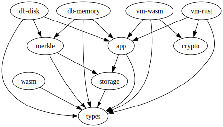

# Cosmos Wasm Daemon

An execution environment for blockchains.

## Crates

The CWD project consists of the following Rust crates:

| crate                           | description                                                                |
| ------------------------------- | -------------------------------------------------------------------------- |
| [app](./crates/app)             | state machine transition logics and [Tendermint ABCI][abci] implementation |
| [crypto](./crates/crypto)       | cryptography functionalities                                               |
| [db-disk](./crates/db-disk)     | an on-disk, persisted DB backend                                           |
| [db-memory](./crates/db-memory) | an in-memory, temporary DB backend; used for testing                       |
| [macros](./crates/macros)       | macros for reducing boilerplates in contract developments                  |
| [merkle](./crates/merkle)       | [Jellyfish Merkle Tree][jmt] (JMT) implementation                          |
| [storage](./crates/storage)     | an ergonomic API for interacting with key-value stores                     |
| [types](./crates/types)         | types, traits, and helper functions                                        |
| [vm-rust](./crates/vm)          | a VM that runs native Rust codes; used for testing                         |
| [vm-wasm](./crates/vm)          | a VM that runs Wasm byte codes                                             |
| [wasm](./crates/wasm)           | an ergonomic API for building Wasm modules                                 |

Additionally, there are [cw-testing](./crates/testing) which provides testing utilities, and [cw-std](./crates/std), a "meta package", which re-exports contents from the above crates, for the convenience of contract developers.

### Modularity

At the heart of the project is the `cw_app::App` type. Fundamentally, a blockchain is a state machine that consists of 1) the state, typically represented by a key-value database, and 2) the state transition rule, which typically involves a virtual machine that runs smart contracts. Therefore, our `App` takes two generics, representing the DB and the VM, respectively:

```rust
struct App<DB, VM> {
    db: DB,
    vm: PhantomData<VM>,
}
```

Here, `DB` must implement the `cw_types::Db` trait, while `VM` must implement the `cw_types::Vm` trait.

We will ship two `Db` and two `Vm` implementations, for different use cases:

| use case        | implementation        |
| --------------- | --------------------- |
| production node | `App<DiskDb, WasmVm>` |
| testing         | `App<MemDb, RustVm>`  |

### Dependency graph

The below diagram shows the dependency relations between the crates:



## How to use

Prerequisites:

- [Rust][rustup] with `wasm32-unknown-unknown` target
- [Just][just]
- [Docker][docker]

Install the **cwd** and **cwcli** command line s
oftware:

```shell
just install
```

Run tests:

```shell
just test
```

Lint the code:

```shell
just lint
```

Compile and optimize smart contracts:

```shell
just optimize
```

## Tooling

The developer tooling we use for this project is listed below. Finding the right tools is important for productivity but can take time. We hope you will find this useful:

| tool            | Rust         | TypeScript         |
| --------------- | ------------ | ------------------ |
| package manager | cargo        | [pnpm][pnpm]       |
| bundler         | cargo build  | [tsup][tsup]       |
| tester          | cargo test   | [vitest][vitest]   |
| linter          | cargo clippy | [biome][biome]     |
| formatter       | cargo fmt    | [biome][biome]     |
| documentation   | cargo doc    | [typedoc][typedoc] |

## Acknowledgement

TODO

## License

TBD

[abci]:    https://github.com/tendermint/tendermint/tree/main/spec/abci
[biome]:   https://www.npmjs.com/package/@biomejs/biome
[docker]:  https://docs.docker.com/engine/install/
[jmt]:     https://developers.diem.com/docs/technical-papers/jellyfish-merkle-tree-paper/
[just]:    https://just.systems/man/en/
[pnpm]:    https://www.npmjs.com/package/pnpm
[rustup]:  https://rustup.rs/
[tsup]:    https://www.npmjs.com/package/tsup
[typedoc]: https://www.npmjs.com/package/typedoc
[vitest]:  https://www.npmjs.com/package/vitest
