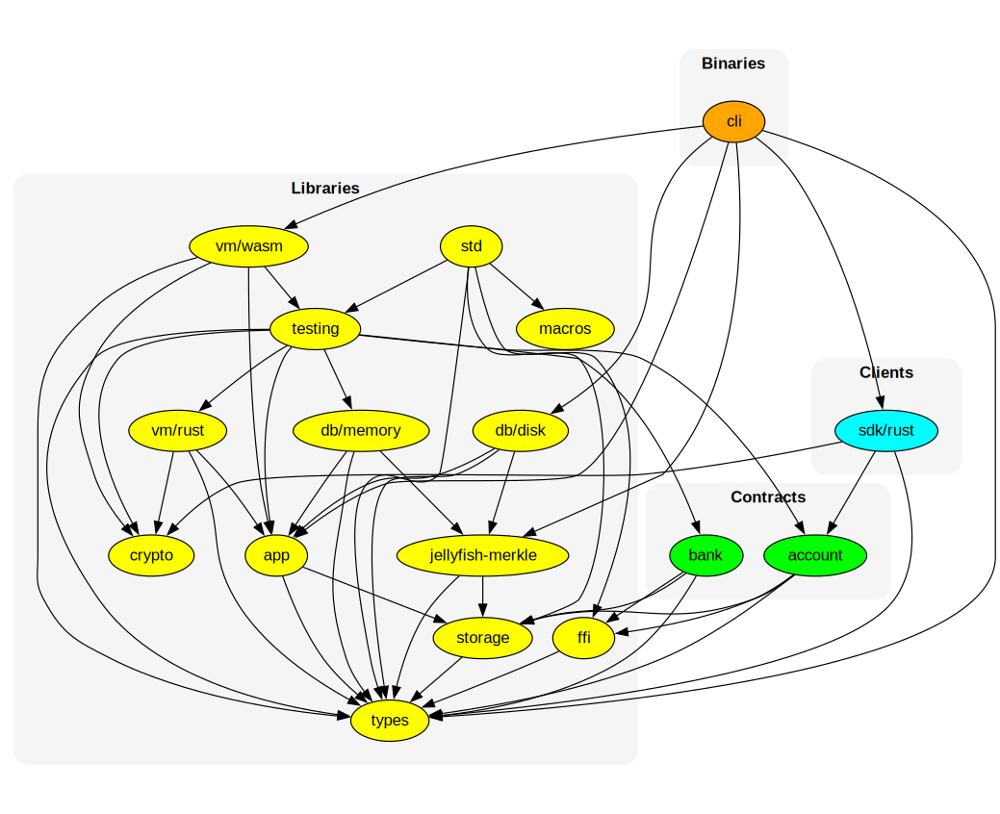

<div align="center">
  
</div>

# Grug

An execution environment for blockchains.

👉 [Whitepaper][grug] 👈

## Overview

Grug consists of the following Rust crates:

| crate                                         | description                                                                |
| --------------------------------------------- | -------------------------------------------------------------------------- |
| [app](./crates/app)                           | state machine transition logics and [Tendermint ABCI][abci] implementation |
| [crypto](./crates/crypto)                     | cryptography functionalities                                               |
| [db/disk](./crates/db/disk)                   | an on-disk, persisted DB backend                                           |
| [db/memory](./crates/db/memory)               | an in-memory, ephemeral DB backend; used for testing                       |
| [ffi](./crates/ffi)                           | helpers for building or interacting with [FFI][ffi]                        |
| [macros](./crates/macros)                     | procedural macros for reducing boilerplates in contract developments       |
| [jellyfish-merkle](./crates/jellyfish-merkle) | [Jellyfish Merkle Tree][jmt] (JMT) implementation                          |
| [storage](./crates/storage)                   | abstractions over key-value stores                                         |
| [types](./crates/types)                       | types, traits, and some helper functions                                   |
| [vm/rust](./crates/vm/rust)                   | a VM that runs native Rust codes; used for testing                         |
| [vm/wasm](./crates/vm/wasm)                   | a VM that runs WebAssembly byte codes                                      |

Additionally, there are [grug-testing](./crates/testing) which provides testing utilities, and [grug-std](./crates/std), a "meta-crate", which re-exports contents from the above crates, for the convenience of contract developers.

### Modularity

At the heart of the project is the `grug_app::App` type. Fundamentally, a blockchain is a state machine that consists of 1) the state, typically represented by a key-value database, and 2) the state transition rule, which typically involves a virtual machine that runs smart contracts. Therefore, our `App` takes two generics, representing the DB and the VM, respectively:

```rust
struct App<DB, VM> {
    db: DB,
    vm: VM,
}
```

Here, `DB` must implement the `grug_types::Db` trait, while `VM` must implement the `grug_types::Vm` trait.

We will ship two `Db` and two `Vm` implementations, for different use cases:

| use case        | implementation        |
| --------------- | --------------------- |
| production node | `App<DiskDb, WasmVm>` |
| testing         | `App<MemDb, RustVm>`  |

### Dependency graph

The below diagram shows the dependency relations between the crates:



## How to use

Prerequisites:

- [Rust][rustup] with `wasm32-unknown-unknown` target
- [Just][just]
- [Docker][docker]

Install the `grug` command line software:

```shell
just install
```

Run tests:

```shell
just test
```

Lint the code:

```shell
just lint
```

Compile and optimize smart contracts:

```shell
just optimize
```

## Acknowledgement

TODO

## License

TBD

[abci]:   https://github.com/tendermint/tendermint/tree/main/spec/abci
[docker]: https://docs.docker.com/engine/install/
[grug]:   https://leftcurve.software/grug.html
[ffi]:    https://en.wikipedia.org/wiki/Foreign_function_interface
[jmt]:    https://developers.diem.com/docs/technical-papers/jellyfish-merkle-tree-paper/
[just]:   https://just.systems/man/en/
[rustup]: https://rustup.rs/
