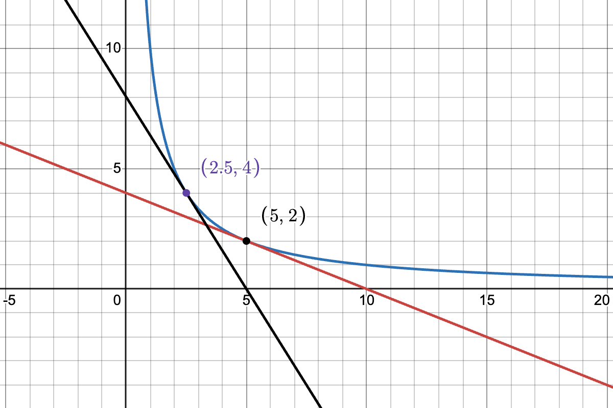
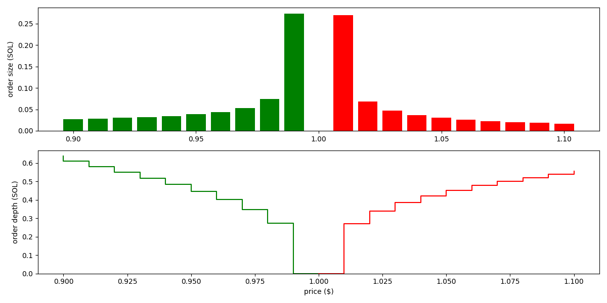

# Passive liquidity on Dango DEX

Dango DEX is a fully onchain limit order book (LOB) exchange. It uses [frequent batch auctions (FBAs)][fba], executed at the end of each block, to match orders. Otherwise, it's not dissimilar to other LOB exchanges, e.g. Hyperliquid.

A major downside of LOBs vs AMMs is that **market making on LOBs requires a high level of sophistication, making it infeasible to average retail investors**. As such, new LOB exchanges often need to enter into deals with professional market makers (MMs) to provide liquidity. This makes bootstrapping a new LOB exchange very challenging.

From the perspective of an unsophisticated investor who wishes to provide liquidity _complete passively_ on major spot pairs (BTC-USD, ETH-USD, etc.), as of this time, their only options are Uniswap V3 (full range) and Curve V2. However, LP'ing on these AMMs have proven to be generally not profitable due to arbitrage trades.

Loss from arbitrage trades, measured by [loss-versus-rebalancing (LVR)][lvr], occurs when there's another, more liquid venue for trading the same pair, where price discovery primarily takes place. In crypto, this is typically the CEXs: Binance, Coinbase, Kraken, etc. Suppose BTC-USD is trading at 95,000. Then, upon a favorable news, it jumps to 96,000 on Binance. However, AMMs are completely passive--they never actively adjust quotes based on the news. As such, an arbitrageur can buy BTC at the stale price of 95,000 from the AMM, then sell on Binance for 96,000. LPs in the AMM takes the worse side of the trade. Over time, such losses accumulate and more often than not, outpace the gains from fees.

## The objective

Create a passive liquidity pool that provides liquidity on Dango DEX, with the following properties:

- It will **place limit orders in the LOB following a predefined strategy, such as an oracle-informed AMM curve**.
- It aims to be the **backstop liquidity**. Meaning, it doesn't need to quote aggressively with super tight spreads. We anticipate professional MMs will take that role. The pool will quote wider (thus taking less risk), and be the backstop in case a big trade eats up all the orders from MMs.
- It targets majors (BTC, ETH, SOL, etc.) and should be **LVR-resistant**. At Dango, we want to maximize the benefit of LPs by discouraging arbitrage flow.
- It **doesn't aim to be resistant to impermanent loss (IL)**. However, once we ship perpetual futures trading on Dango, we imagine there will be actively managed "vaults" that combine the LP pool and hedging strategies using perps.

## Order placement

Let's discuss how the pool may determine what orders to place in the LOB. Let's think of the simplest strategy: the constant product curve ("xyk curve").

Consider a BTC-USD pool that currently contains $x$ units of BTC (the "base asset") and $y$ units of USD (the "quote asset"). The state of the pool can be considered a point on the curve $I(x, y) = x y = K$, where $K$ is a constant that quantifies how much liquidity there is in the pool. When a trade happens, the state moves to a different point on the same curve (that is, without considering any fee).

Generally, for any AMM curve $I(x, y)$, we define the concept of **marginal price** as:

$$
p_{\mathrm{m}} (x, y) = - \frac{\mathrm{d}y}{\mathrm{d}x} = \frac{\frac{\partial I}{\partial{x}}}{\frac{\partial I}{\partial y}}
$$

For the xyk curve, this is:

$$
p_{\mathrm{m}} (x, y) = \frac{y}{x}
$$

$p_{\mathrm{m}}$ is the price, denoted as the units of quote asset per one unit of base asset (that is, $y$ over $x$), of trading an infinitesimal amount of one asset to the other. On a graph, it is the slope of the tangent line that touches the curve at the point $(x, y)$.

Let's imagine the pool starts from the state of $(x_0 = 5, y_0 = 2)$; marginal price $p_{\mathrm{m}} (x_0, y_0) = 0.4$ USD per BTC.

At this time, if a trader swaps 2 units of USD to 2.5 units of BTC, the state would move to the point $(x_1 = 2.5, y_1 = 4)$, marginal price $p_{\mathrm{m}} (x_1, y_1) = 1.6$ USD per BTC.

We interpret this as follows: **under the state of $(x = 5, y = 2)$ and following the strategy defined by the xyk curve, the pool offers to sell 2.5 units of BTC over the price range of 0.4--1.6 USD per BTC**.

Translating this to the context of orderbook, this means **the pool would place SELL orders of sizes totalling 2.5 units of BTC between the prices 0.4 and 1.6**.

Following this logic, we can devise the following algorithm to work out all the SELL orders that the pool would place:

- The pool is parameterized by spread $p_{\mathrm{s}}$ and "bin size" $\Delta p$.
- Start from the marginal price $p_{\mathrm{m}} (x_0, y_0)$ (we denote this simply as $p_{\mathrm{m}}$ from here on).
  - The pool would not place any order here. We say the total order size here is zero.
- Move on to the "bin" at price $p_0 = p_{\mathrm{m}} + \frac{1}{2} p_{\mathrm{s}}$ (marginal price plus the half spread).
  - This is the price at which the pool will place its first SELL order.
  - Using the approach discussed above, find the total order size between the prices $p_0$ and $p_{\mathrm{m}}$. This is the size of the order to be place here.
- Move on to the next "bin", at price $p_1 = p_0 + \Delta p$.
  - Using the approach discussed above, find the total order size between the prices $p_1$ and $p_0$.
  - Subtract the total order size between $p_{\mathrm{m}}$ and $p_0$, this is the order size to be placed here.
- Do the same for $p_2$, $p_3$, ... until liquidity runs out (total order size $\ge x_0$).

With the same approach, we can work out all the BUY orders for prices below $p_{\mathrm{m}}$.

For the xyk curve, the orders are visualized as follows (based on the state $x_0 = 1$, $y_0 = 200$ and parameters $p_{\mathrm{s}} = 0.2$, $\Delta p = 0.1$):

We see the pool places orders of roughtly the same size across a wide price range. That is, the liquidity isn't concentrated.

As example for a concentrated liquidity curve, the Solidly curve $I(x, y) = x^3 y + x y^3$ results in the following orders:

As we see, liquidity is significantly more concentrated here.

## Tackling arbitrage loss

In order to discourage arbitrage flow, **the pool needs to actively adjusts its quote based on the prices trading at other more liquid venues** (the CEXs, in our case).

To achieve this, we simply introduce an oracle price term into the AMM invariant. Suppose the oracle price is $p$. Instead of $I(x, y)$, we simply use the curve:

$$
I_{\mathrm{oracle}}(x, y, p) = I \left( x, \frac{y}{p} \right)
$$

The xyk and Solidly curves become the following, respectively:

$$
I_{\mathrm{oracle}}(x, y, p) = x \left( \frac{y}{p} \right)
$$

$$
I_{\mathrm{oracle}}(x, y, p) = x^3 \left( \frac{y}{p} \right) + x \left( \frac{y}{p} \right)^3
$$

Following the same example with Solidly above, but set oracle price to $p = 210$ (higher than the margin price of 200), the orders become:

As we see, the pool now quotes around the price of 210. It places bigger orders on the SELL side than the BUY side, demonstrating that it has a tendency to reduce its holding of the base asset, so that its inventory goes closer the ratio of 1:210 as the oracle indicates.

## Oracle risk

The biggest risk of an oracle-informed AMM is that the oracle reports incorrect prices. For example, if BTC is trading at 95,000, but the oracle says the price is 0.0001, then traders are able to buy BTC from Dango at around 0.0001, resulting in almost total loss for our LPs.

To reduce the chance of this happening, we plan to employ the following:

- Use a low latency oracle, specifically [Pyth's 10 ms or 50 ms feed][pythlazer].
- Pyth prices come with a confidence range, meaning a range it thinks there's a 95% probability the true price is in. Our parameter $p_{\mathrm{s}}$ should be configured to be similar or larger than this.
- Make the oracle a part of our block building logic. A block is invalid if it doesn't contain an oracle price. The block producer must submit the price in a transaction on the top of the block.
- The LP pool is given priority to adjust its orders in response to the oracle price before anyone else. Specifically, since we use FBA, the LP pool is allowed to adjust its orders prior to the auction.
- Implement circuit breakers, that if triggered, the LP pool would cancel all its orders and do nothing, until the situation goes back to normal. These can include:
  - Oracle price is too old (older than a given threshold).
  - Oracle price makes too big of a jump (e.g. it goes from 95,000 to 0.0001).

## Open questions

- A Professional market maker usually doesn't place orders around the oracle price, but rather computes a "reservation price" based on the oracle price as well as his current inventory. Additionally, he usually doesn't use equal spread on both sides, but rather skewed spreads based on inventory. A classic model for computing these is that by [Avellaneda and Stoikov][avellaneda]. Our model do not do these.
- Whereas Solidly is the simplest concentrated liquidity curve (simpler than Curve V1 or V2), it's still quite computationally heavy. We need to solve a quartic (4th degree polynomial) equation using Newton's method, for each "bin", each block. We would like to explore simpler concentrated liquidity curves.

[fba]: https://academic.oup.com/qje/article/130/4/1547/1916146
[lvr]: https://arxiv.org/abs/2208.06046
[pythlazer]: https://www.pyth.network/
[avellaneda]: https://www.tandfonline.com/doi/abs/10.1080/14697680701381228
