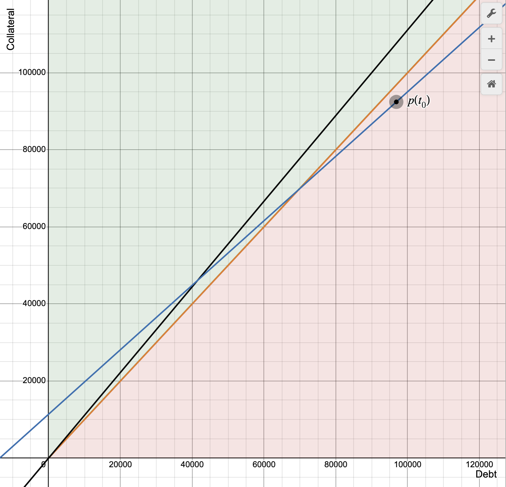

# Margin Account Liquidation Math

This is a short note to explain the math behind margin account liquidation. Dango's margin account liquidation is based on Euler's dynamic liquidation bonus method, or "Dutch Liquidation". Please see this [paper](https://docs.euler.finance/Dutch_Liquidation_Analysis.pdf) for more details.

## Defintions

- Collateral power: The adjustment factor for the collateral value of a given collateral token. Meaning, if the collateral token has a collateral power of 0.9, then the value of the collateral token is 90% of its actual value.
- Utilization rate: The ratio of the total value of the debts to the total value of the account's collateral adjusted for the collateral power. When the utilization rate is greater than 1, the account is undercollateralized and can be liquidated.
- Health factor: The inverse of the utilization rate. When the health factor is less than 1, the account is undercollateralized and can be liquidated.
- Liquidation bonus: The amount of extra collateral that is awarded to the liquidator to incentivize them to liquidate the account.

## Calculating The Maximum Repayable Debt

When liquidating the account, we have a target utilization rate (which is a fraction between 0 and 1, set by governance) that we want to reach after the liquidation. We then calculate the maximum amount of debt that can be repaid to reach this target utilization rate.

In our system, the liquidation bonus is defined as a function of the health factor:

$$
\mathrm{liquidation\ bonus} = 1 - \mathrm{health\ factor}
$$

This means that the more undercollateralized the account is, the higher the liquidation bonus.

Consider the below graph showing an undercollateralized margin account:

The x-axis represents the value of account's debt and the y-axis represents the value of account's collateral adjusted for the collateral power. The point $p(t_0)$ is the account's current status. Since it is below the orange line, it is undercollateralized and eligible for liquidation. The blue line represents the trajectory of the liquidation. The black line represents all points at which the account's utilization rate is equal to the target utilization rate. The maximum repayable debt therefore is found at the intersection of the blue line and the black line.

### Liquidation Trajectory

We can think of a user’s position as a point $p = (d, c)$ in the debt and adjusted collateral plane. To derive the equation for the liquidation trajectory, we can use the point slope form of the equation for a line:

$$
y - y_0 = m(x - x_0)
$$

where $m$ is the slope or gradient of the line and $(x_0, y_0)$ is a point on the line.

For a liquidation value $a$ (the value of the debt repaid by the liquidator), the corresponding amount of collateral adjusted by the collateral power that is returned to the liquidator as payment is equal to $(1 + b)va$.

Therefore, the gradient is given by,

$$
\frac{\Delta c}{\Delta d} = \frac{c(t_1) - c(t_0)}{d(t_1) - d(t_0)} = \frac{c(t_0) - (1 + b(t_0))va - c(t_0)}{d(t_0) − a − d(t_0)} = 1 + b(t_0)v
$$

where $v$ is the collateral power of the liquidator's requested collateral denom, $b(t_0)$ is the liquidation bonus before the liquidation, $c(t_0)$ and $c(t_1)$ is the value of the collateral (adjusted for the collateral power) before and after the liquidation, and $d(t_0)$ and $d(t_1)$ is the value of the debts before and after the liquidation, respectively.

Therefore, we can rewrite the equation for the liquidation trajectory as:

$$
y - c = m(x - d) = (1 + b)v(x - d)
$$

which can be rewritten as:

$$
y = (1 + b)vx + c - (1 + b)vd
$$

### Target Health Factor

Since the health factor is the value of the collateral (adjusted for the collateral power) divided by the value of the debts, we can express it as:

$$
\mathrm{health\ factor} = \frac{c}{d}
$$

Therefore, we can rewrite the equation for the line which defines all points at which the health factor is equal to the target health factor as:

$$
y = t \cdot x
$$

where $t$ is the target health factor.

### Maximum Repayable Debt

The maximum repayable debt is found at the intersection of the liquidation trajectory and the line which defines all points at which the health factor is equal to the target health factor. To find this intersection, we set the two above equations equal to each other:

$$
t \cdot x = (1 + b)vx + c - (1 + b)vd
$$

Solving for $x$:

$$
tx - (1 + b)vx = c - (1 + b)vd
$$

...

$$
(t - (1 + b)v)x = c - (1 + b)vd
$$

...

$$
x = \frac{c - (1 + b)vd}{t - (1 + b)v}
$$

This x defines the amount of debt after the liquidation if the new health factor is equal to the target health factor. Thus, the maximum repayable debt is equal to the prior debt minus this amount:

$$
\mathrm{max\ repayable\ debt} = d - x = d - \frac{c - (1 + b)vd}{t - (1 + b)v}
$$
