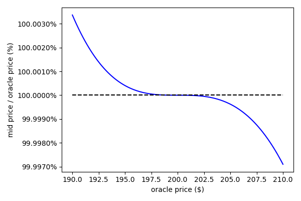

# Dango DEX

Dango DEX is a fully onchain spot limit order book exchange that:

- allows for passive liquidity provision;
- is resistent to LVR;
- is resistent to MEV.

It is one of the two flagship apps of our upcoming DeFi ecosystem [Dango](https://x.com/dango_zone), besides the cross-collateralized **credit account**. To learn more about the credit account, check out this video. **[TODO: ADD URL]**

This paper is laid out as follows: 1) identifying the problems in today's DeFi exchanges; 2) analyzing the causes of the problems; and 3) proposing our solutions.

## Background

### TradFi

In traditional finance (TradFi) markets, **limit order book** (LOB) is the primary venue for trading. A limit order consists of the quantity of asset the trader wishes to buy/sell, and a limit price at which or better the trade must be executed.

**Market makers** (MMs) facilitate trades by strategically placing orders below and above the prevailing market place. E.g., suppose Apple stock (AAPL) is trading at $200. An MM may place a BUY order at $199.5 and a SELL order at $200.5. The $1 difference is known as the **spread**. If a trader sells AAPL to the MM by taking the said BUY order, then another trader buys AAPL by taking the said SELL order, the MM has made $1. This is typically described as the MM "making money on the spread".

MMs bet the stock's price goes side ways, i.e. there is roughly the same buy and sell volume. If the market only goes one way, the MM accumulates one side of the inventory, which is the underperforming side. E.g., if there is consistently more sellers of AAPL than buyers, the MM's BUY orders get consistently picked up more often than his SELL orders, he would accumuate a large inventory of AAPL, an asset that's going down in price. He would underperform the trading strategy that simply holds the initial inventory without market making. This is known as the **inventory risk** which is rooted in the asset's price volatility. MMs usually use **hedging** to mitigate this risk.

Another major risk faced by MMs is from **information asymmetry**. Suppose Apple releases a better-than-expected earnings report, causing the "fair value" of its stock to jump to $300. However, the MM is still placing orders around the **stale price** of $200, either because he isn't aware of the news or is slow to update the quotes. An **informed trader** is one well informed on the news and able to execute trades faster. He is able to pick up the MM's SELL order at $200.5 and immediately resell the stock for $300, pocketing the arbitrage gain. The MM loses value because he has sold the stock at a much lower-than-market price. To mitigate this, MMs invest hundreds of millions of dollars to improve their speed of executing trades. This is a very high level of sophistication that makes market making inaccessible to most retail investors.

### DeFi

Maintaining a LOB and executing orders is computationally costly. For this reason, onchain finance has historically relied on **constant function market makers** (CFMMs) instead of LOBs.

An CFMM, instead of maintaining a book of limit orders, maintains a pool of liquidity and quotes prices based on a predefined **invariant** function. An invariant is a function $f(x, y)$ that yields the same value before and after a trade, where $x$ and $y$ are the quantities of the **base asset** and the **quote asset**, respectively (known as the pool's **reserves**):

$$
f(x, y) = K \ (\mathrm{constant})
$$

Suppose a pool contains base asset $\mathtt{A}$ and quote asset $\mathtt{B}$ of quantities $A$ and $B$, respectively, and a trader wishes to swap $a$ amount of $\mathtt{A}$ into $\mathtt{B}$. The pool would determine the output amount $b$ by solving the equation:

$$
f(A, B) = f(A + a, B - b) = K
$$

Similarly, a swap from $b$ amount of $\mathtt{B}$ into $\mathtt{A}$ will have its output amount $a$ determined by:

$$
f(A, B) = f(A - a, B + b) = K
$$

Note that this doesn't consider trading fees. Since there is no such thing as "spread" in CFMMs as in LOBs, the pool makes money for its liquidity providers (LPs) by charging a fee on each trade. Specifically, a small portion of the trade's output is deducted and injected into the pool. The value of $K$ slightly increases as a result. As such, $K$ can be considered as a measurement of how much liquidity there is in the pool, regardless of the asset prices.

CFMMs share the same risks as LOBs as described in the previous section. Firstly, LPs in an CFMM pool bet the two assets' relative price stays roughly constant. If one asset's price drops relative to the other, the pool accumulates this underperforming asset. Not considering fees, this would underperform the strategy of simply holding the two assets and not market making. This is known as **impermanent loss** (IL). Similarly as with LOBs, this risk is rooted in the asset's volatility, and can be mitigated through hedging.

In terms of information asymmetry, CFMMs are categorically worse than LOBs. A traditional CFMM _never_ adjusts its quotes in response to new information. Therefore, from an LP's perspective, a CFMM always trades at worse than the market price. The loss incurred from this fact, in known as **loss-versus-rebalancing** (LVR).

A **searcher** is a trader who scans onchain DEXs for stale prices, and executes CEX-DEX arbitrages.

## The problems

## Our solution

We propose solving the above problems as follows:

- Create a LOB that has an enshrined passive liquidity pool. The pool will place orders in the LOB following a CFMM invariant.
- In order to mitigate LVR, we must;
  - make available a high-frequency, low-latency oracle reporting the latest prevailing market prices;
  - incorporate this oracle feed into the liquidity pool's CFMM invariant;
  - give the pool priority in adjusting its quotes over other traders.
- In order to mitigate MEV, we must:
  - use a private mempool so that user orders aren't public;
  - use frequent, uniform price, sealed bid auctions to match and execute orders, so that HFTs don't have time advantage over other traders.

First, let's discuss how to incorporate a passive CFMM pool into a LOB. Let's start with the simplest form of CFMM invariants, the **xyk invariant**.

### Passive liquidity on a LOB following the xyk invariant

The xyk invariant, [proposed by Martin Köppelmann](https://ethresear.ch/t/improving-front-running-resistance-of-x-y-k-market-makers/1281), has the form:

$$
f(x, y) = x \cdot y = K
$$

How would the pool place orders in a LOB, following this invariant? Let's start with the BUY side. Suppose the pool has reserves $x = A$ and $y = B$. It places a BUY order, offering $b_{\mathrm{bid}}$ units of the quote asset $\mathtt{B}$ in exchange for $a_{\mathrm{bid}}$ units of the base asset $\mathtt{A}$, at price $p$. The invariant must hold:

$$
A B = (A + a_{\mathrm{bid}}) (B - b_{\mathrm{bid}})
$$

By definition:

$$
p = \frac{b_{\mathrm{bid}}}{a_{\mathrm{bid}}}
$$

Putting these together, we can easily solve:

$$
a_{\mathrm{bid}} = -A + \frac{B}{p}
$$

Similarly, on the SELL side, we have:

$$
A B = (A - a_{\mathrm{ask}}) (B + b_{\mathrm{ask}})
$$

$$
p = \frac{b_{\mathrm{ask}}}{a_{\mathrm{ask}}}
$$

$$
a_{\mathrm{ask}} = A - \frac{B}{p}
$$

It's immediately obvious that in both cases, if $p = \frac{B}{A}$, then $a = 0$. This is a special price, at which the pool does not offer to buy or sell in any amount, we denote as the **pool price** $p_{\mathrm{pool}}$. In the most general case, $p_{\mathrm{pool}}$ is _the price at which the trade swapping an infinitesimal amount of base asset into the quote asset is executed_:

$$
p_{\mathrm{pool}}(x, y) = - \frac{\mathrm{d}y}{\mathrm{d}x}
$$

Since $x$ and $y$ follows $f(x, y) = K$, using the chain rule of multivariant functions, we can get:

$$
p_{\mathrm{pool}}(x, y) = \frac{\frac{\partial f}{\partial x}}{\frac{\partial f}{\partial y}}
$$

For the xyk invariant specifically, this is:

$$
p_{\mathrm{pool}}(x, y) = \frac{y}{x}
$$

Intuitively, $p_{\mathrm{pool}}$ is the "inherit", "equilibrium" price of the pool implied by its reserves. The pool will place orders around this price.

At any price $p < p_{\mathrm{pool}}$, $a_{\mathrm{bid}} > 0$. This can be understood as the pool offers to buy $a_{\mathrm{bid}}$ amount of the base asset between prices $p$ and $p_{\mathrm{pool}}$.

Of course, prices LOBs are discret, separated by **ticks**. Let's say the tick size is $\Delta p$. Consider the price one tick above $p$, $p' = p + \Delta p$:

$$
a'_{\mathrm{bid}} = -A + \frac{B}{p'}
$$

$$
\Delta a_{\mathrm{bid}} = a_{\mathrm{bid}} - a'_{\mathrm{bid}} = B \left(\frac{1}{p} - \frac{1}{p'} \right) = B \frac{\Delta p}{p (p + \Delta p)}
$$

This is the quantity of BUY order that the pool will place at price $p'$.

Similarly, one the SELL side, for two prices $p' = p - \Delta p$ and $p' > p_{\mathrm{pool}}$:

$$
\Delta a_{\mathrm{ask}} = a_{\mathrm{ask}} - a'_{\mathrm{ask}} = B \left(\frac{1}{p} - \frac{1}{p'} \right) = B \frac{\Delta p}{p (p - \Delta p)}
$$

#### Example

Consider a pool containing base asset SOL of quantity $A = 1$ and quote asset USD of quantity $B = 200$. Pool price $p_{\mathrm{pool}} = \$ 200$. Plotting the order sizes $\Delta a_{\mathrm{bid}}$, $\Delta a_{\mathrm{ask}}$ as well as cumulative buy/sell demand agianst price $p$:

#### Brief conclusion

We have established the concept of pool price $p_{\mathrm{pool}}$, and a way to derive buy/sell order size $\Delta a_{\mathrm{bid}}$ and $\Delta a_{\mathrm{ask}}$ in relation to price $p$.

Looking at the order depth chart of the xyk invariant, it puts liquidity roughly evenly over a wide range of prices. This in capital inefficient; ideally, we want to concentrate the liquidity in the region close to $p_{\mathrm{pool}}$.

Additionally, this invariant is not LVR-resistant, as $p_{\mathrm{pool}}$ does not adjust in response to the change of price in CEXs.

### Passive liquidity on a LOB following the Solidly invariant

The Solidly invariant, [conceived by Andre Cronje](https://x.com/0xdef1/status/1482133989720743946), has the form:

$$
f(x, y) = x^3 y + x y^3 = K
$$

This curve assumes the two asset has the same price. In case they're not the same price, and we have an oracle feed that one unit of $x$ is equivalent in value to $R$ units of $y$, the formula can be updated to:

$$
f(x, y) = x^3 \left( \frac{y}{R} \right) + x \left( \frac{y}{R} \right)^3
$$

The pool price is:

$$
p_{\mathrm{pool}}(x, y) = \frac{2 R^2 x^2 y + y^3}{R^2 x^3 + a x y^2}
$$

Let's derive $a_{\mathrm{bid}}$ the same way as we did for the xyk pool. Suppose the pool as reserves $A$ and $B$ prior to the swap:

$$
f(A, B) = A^3 \left( \frac{B}{R} \right) + A \left( \frac{B}{R} \right)^3 = K
$$

On the BUY side, a trader inputs $a_{\mathrm{bid}}$ units of base asset, receives $b_{\mathrm{bid}}$ units of quote asset. The trade executes at the price:

$$
p = \frac{b_{\mathrm{bid}}}{a_{\mathrm{bid}}}
$$

For convenience, let's denote:

$$
\alpha = A + a_{\mathrm{bid}}
$$

$$
\beta = \frac{B - b_{\mathrm{bid}}}{R} = \frac{B - p a_{\mathrm{bid}}}{R}
$$

Essentially, $\alpha$ is the pool's base asset reserve after the trade, $\beta$ is the quote asset reserve after the trade, adjusted for the oracle price.

The invariant must also hold after the trade:

$$
f(A + a_{\mathrm{bid}}, B - b_{\mathrm{bid}}) = \alpha^3 \beta + \alpha \beta^3 = K
$$

This is a 4th-degree (quartic) equation, so finding a closed form solution is not feasible. Instead, we solve it by **Newton's method**. Define:

$$
g(a_{\mathrm{bid}}) = \alpha^3 \beta + \alpha \beta^3 - K
$$

We must solve for $a_{\mathrm{bid}}$ such that $g(a_{\mathrm{bid}}) = 0$. This can be done by:

- choose an initial value $a_0 \gets A$
- for $n = 1, 2, 3, \dots$:
  - $a_n \gets a_{n-1} - \frac{g(a_{n-1})}{g'(a_{n-1})}$
  - if converge, return $a_n$ as the solution for $a_{\mathrm{bid}}$

where

$$
g'(a_{\mathrm{bid}}) = -\frac{p}{R} \alpha^3 + a \alpha^2 \beta - \frac{3p}{R} \alpha \beta^2 + \beta^3
$$

The choice of the initial value $a_0$ is important. This is because $g(a_{\mathrm{bid}}) = 0$ has a trivial solution of $a_{\mathrm{bid}} = 0$, which corresponding to not placing an order at all. Instead, we want to find the non-trivial solution of $a_{\mathrm{bid}} > 0$. Emprically, choosing $a_0 = A$ always gives us the intended solution.

For the SELL side, we do exactly the same, except for:

$$
\alpha = A - a_{\mathrm{ask}}
$$

$$
\beta = \frac{B + b_{\mathrm{ask}}}{R} = \frac{B + p a_{\mathrm{ask}}}{R}
$$

$$
g'(a_{\mathrm{ask}}) = \frac{p}{R} \alpha^3 - a \alpha^2 \beta + \frac{3p}{R} \alpha \beta^2 - \beta^3
$$

Plot the results:

It's obviously the indeed the liquidity is now concentrated around the pool price.

The above plot assumes oracle equals exactly the pool price: $R = 200$. However, the usual case is they don't match. Remember that in order to mitigate LVR, we need $p_{\mathrm{pool}}$ to closely track $R$. Let's plot the deviation of $p_{\mathrm{pool}}$ from $R$ against $R$:

As seen, the deviation does not exceed 0.003% when oracle price jumps less than ~5%. As such, we believe the pool is not ssusceptible to LVR, given that the oracle price's latency is sufficient low to reflect the true asset price.

## Challenges

The main downside of this design is that trades are asynchronous.

## Conclusion

| The problem                                                  | The cause                                                                                 | Our solution                                                                                                           |
| ------------------------------------------------------------ | ----------------------------------------------------------------------------------------- | ---------------------------------------------------------------------------------------------------------------------- |
| Market making on LOBs is not accessible for retail investors | High level of sophistication is required                                                  | Our LOB to be enshrined with a passive liquidity pool that follows the Solidly AMM curve                               |
| LVR                                                          | AMMs do not actively adjust quotes in reaction to changes in asset prices                 | Our passive liquidity pool to adjust its curve based on a low-latency oracle feed, with priority over any other trader |
| MEV                                                          | User orders are broadcasted publicly; some traders have information advantage over others | Private mempool; frequent sealed-bid batch auctions at uniform prices                                                  |
