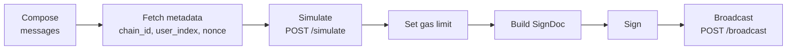

# API Reference

Every Dango deployment exposes its data and trading surface over two HTTP servers:

- the **Live API** — the consensus node, which talks to CometBFT, performs state transitions, and serves the latest chain state, transaction broadcasting, and real-time streaming; and
- the **Archive API** — the archive node, which ingests finalized blocks, analyzes them, and serves structured historical data backed by SQL databases.

The Live API speaks **REST** and **WebSocket**; the Archive API speaks **REST**. This chapter is a guide to both. The exhaustive, always-current endpoint reference lives in each server's interactive documentation (see [§1.2](#12-interactive-reference)); this chapter covers the concepts that reference cannot express — the two-server model, the transaction lifecycle and signing, the WebSocket protocol, and the perps-specific semantics — and points to the interactive docs for the mechanical detail.

> **Deprecation notice.** Dango nodes historically exposed a single **GraphQL** endpoint, which backed the frontend and most trading bots. GraphQL is being **phased out** in favor of the REST + WebSocket surface documented here, and the monolithic server is being split into the two servers above. New integrations should target REST + WebSocket. The GraphQL endpoint remains available during the transition but is unmaintained and will be removed; it is not documented here.

## 1. Overview

### 1.1 The two APIs

| I want to… | Use | Transport |
| ---------- | --- | --------- |
| Read the **latest** chain state (prices, my positions, order book, parameters) | Live API | REST `POST /query`, `GET /perps/*`, `GET /account/*` |
| Submit a transaction (trade, deposit, vault, account ops) | Live API | REST `POST /simulate` + `POST /broadcast` |
| **Stream** real-time data (fills, blocks, order book) | Live API | WebSocket `GET /ws` |
| Read **structured history** (past fills, transactions, events) | Archive API | REST feeds (`/transactions/*`, `/events/*`) |
| Read a **full block** at any height | Archive API | REST `GET /blocks/{height}` |

The division reflects where the data lives. The Live API answers from the node's in-memory and latest-committed state — it is always current but keeps only a shallow window of history. The Archive API answers from SQL databases populated by analyzing every block — it reaches back to genesis but trails the chain tip slightly (see [§6.1](#61-feed-model)).

A quick mental model for readers coming from other venues: `POST /query` is the universal read (Dango's analogue of Hyperliquid's `/info`), and the `GET /perps/*` and `GET /account/*` routes are typed shortcuts over it; `POST /broadcast` is the universal write (the analogue of Hyperliquid's `/exchange`).

### 1.2 Interactive reference

Both servers **auto-generate an OpenAPI specification and a Swagger UI** from the handlers themselves, served at `/docs/` (with the raw spec at `/openapi.json`). This is the source of truth for paths, HTTP methods, query and path **parameters**, and status codes — it can never drift from the code, because it is generated from it. Hitting the base path of either server (`GET /`) redirects to its docs.

| API | Interactive docs |
| --- | ---------------- |
| Live | `https://<live-host>/docs/` |
| Archive | `https://<archive-host>/docs/` |

See [Constants](9-constants.md#endpoints) for the concrete hostnames.

One caveat shapes how this chapter divides labor with Swagger: the Live API's read handlers return their contract responses as **opaque JSON**, so Swagger documents their _parameters_ but not their _response shapes_. Those response shapes are documented here, in the [Types reference](#8-types-reference). The Archive API's feeds return typed objects, so Swagger documents their responses in full; this chapter describes them only in outline. And OpenAPI cannot model WebSocket traffic at all, so the entire [WebSocket section](#5-live-api--real-time-websocket) lives here.

### 1.3 Base URLs

See [Constants](9-constants.md#endpoints) for the mainnet and testnet hostnames of both servers, the WebSocket URL, and the testnet faucet.

## 2. Conventions

These conventions apply across both servers. Reading them first keeps the rest of the chapter terse.

### 2.1 Data types and encoding

All requests and responses are JSON. Contract-specific message keys are **snake_case**.

The perps exchange's numeric types are **signed fixed-point decimals with 6 decimal places**, built on [`dango_types::Number`](https://github.com/left-curve/left-curve/blob/main/dango/exchange/types/src/typed_number.rs). They are serialized as **strings** to avoid floating-point loss:

| Type alias | Dimension | Example usage | Example value |
| ---------- | --------- | ------------- | ------------- |
| `Dimensionless` | (pure scalar) | Fee rates, margin ratios, slippage | `"0.050000"` |
| `Quantity` | quantity | Position size, order size, open interest | `"-0.500000"` |
| `UsdValue` | usd | Margin, PnL, notional, fees | `"10000.000000"` |
| `UsdPrice` | usd / quantity | Oracle price, limit price, entry price | `"65000.000000"` |
| `FundingPerUnit` | usd / quantity | Cumulative funding accumulator | `"0.000123"` |
| `FundingRate` | per day | Funding rate, funding rate cap | `"0.000500"` |

Additional scalar types:

| Type | Encoding | Description |
| ---- | -------- | ----------- |
| `Uint128` | string | Large integer (e.g. vault shares) |
| `u64` | number or string | Gas limit, block height |
| `u32` | number | User index, account index, nonce |
| `Timestamp` | string | Seconds since the Unix epoch, fixed-point decimal with up to 9 fractional digits (nanosecond precision), trailing zeros elided — so `"1700000000"`, `"1700000000.5"`, and `"1700000000.123456789"` are all valid. Some feeds instead render time as an RFC 3339 / ISO 8601 string; each is noted where it appears. |
| `Duration` | string | Seconds, same fixed-point encoding as `Timestamp` |

### 2.2 Identifiers

| Type | Format | Example |
| ---- | ------ | ------- |
| `PairId` | `perp/<base><quote>` | `"perp/btcusd"`, `"perp/ethusd"` |
| `OrderId` | `Uint64` (string), system-assigned | `"42"` |
| `ClientOrderId` | `Uint64` (string), caller-assigned | `"42"` |
| `FillId` | `Uint64` (string), per-match | `"17"` |
| `Addr` | lowercase hex, `0x`-prefixed | `"0x1234…abcd"` |
| `Hash256` | 64-char **uppercase** hex, **no** `0x` prefix | `"A1B2C3D4…"` |
| `UserIndex` | `u32` | `0` |
| `AccountIndex` | `u32` | `1` |
| `Username` | 1–15 chars, `[a-z0-9_]` | `"alice"` |

`Addr` and `Hash256` use different text dialects — an address is lowercase and `0x`-prefixed, a hash is bare uppercase. EVM tooling typically displays hashes (e.g. Hyperlane message IDs) as `0x`-prefixed lowercase; strip the prefix and uppercase the rest before passing one to Dango, or the request fails to deserialize.

### 2.3 Pagination

The two servers paginate differently, reflecting their backing stores.

**Live API — contract-native paging.** The enumerating `GET /perps/*` and `GET /account/*` reads forward the contract's own `start_after` / `limit` scheme: iteration begins _after_ the `start_after` key (a `PairId`, `Addr`, or `Denom`, exclusive) and returns at most `limit` entries. Omit both to start from the beginning with the contract's default page size. To page, pass the last key of one response as the next `start_after`.

**Archive API — keyset paging.** Every Archive feed is newest-first and keyset-paginated on `first` (page size, max 50, default 50) and `after` (an opaque cursor). The response is an envelope:

```json
{
  "items": [ /* … */ ],
  "pageInfo": {
    "hasNextPage": true,
    "endCursor": "6f7b…"
  }
}
```

Roll the page's `endCursor` back in as the next request's `after` to fetch the following page; stop when `hasNextPage` is `false`. The cursor is opaque — treat it as a token, do not parse it.

### 2.4 Errors

**Live API REST.** Errors map to HTTP status codes: `400` (malformed body or failed query), `404` (single-item lookup found nothing), `503` (a contract address could not be resolved yet — the chain has not committed its genesis state; retry), `500` (transport failure to the consensus node). The body carries the error message.

**Archive API REST.** Errors are a JSON envelope with the matching status: `400` (malformed argument or cursor), `404` (absent resource), `500` (internal). For example, a bad cursor:

```json
{ "error": "invalid cursor: …" }
```

**WebSocket.** Errors ride the socket as `error`-keyed frames; see [§5.5](#55-reconnect-and-errors) for the frame shape and the code catalog.

### 2.5 Casing

URL **path segments** are kebab-case (`/perps/liquidity-depth`, `/perps/order/by-user`). **Query parameters** keep the snake_case spelling and the wire encoding of the contract fields they forward to — so a numeric grug type stays string-encoded in the query string (`bucket_size=10` parses as a `UsdPrice`), while a plain integer is unquoted (`limit=20`).

## 3. Live API — reading state

All reads in this section answer from the **latest finalized state** and require no authentication.

### 3.1 The universal query

`POST /query` runs any read-only query against the latest state. The body is a raw grug `Query` object; the response is the raw `QueryResponse`. This is the lowest-level, most general read — every typed shortcut in [§3.2](#32-typed-read-shortcuts) desugars to one of these.

**Example — query a contract:**

```bash
curl -X POST https://<live-host>/query \
  -H 'Content-Type: application/json' \
  -d '{"wasm_smart": {"contract": "PERPS_CONTRACT", "msg": {"state": {}}}}'
```

The response is keyed by the request variant:

```json
{ "wasm_smart": { /* the contract's State object */ } }
```

The body accepts any `Query` variant — for example `{"app_config": {}}`, `{"balance": {"address": "0x…", "denom": "bridge/usdc"}}`, or a smart-contract query as above. Some perps reads have no typed shortcut and are reached only this way — for instance a user's cumulative trading volume:

```json
{ "wasm_smart": { "contract": "PERPS_CONTRACT", "msg": { "volume": { "user": "0x…", "since": null } } } }
```

**Multi-query.** To fetch several pieces of state as one **atomic snapshot at a single block height**, wrap them in `multi`. This is the correct way to read, say, oracle prices and a user's positions together — issuing two separate requests may straddle a block boundary and return an inconsistent pair.

```json
{
  "multi": [
    { "wasm_smart": { "contract": "ORACLE_CONTRACT", "msg": { "prices": {} } } },
    { "wasm_smart": { "contract": "PERPS_CONTRACT", "msg": { "user_state": { "user": "0x…" } } } }
  ]
}
```

The response is an array of results positionally matching the requests; each is `{"Ok": …}` or `{"Err": "…"}`, and one failure does not abort the others.

### 3.2 Typed read shortcuts

Typed `GET` routes wrap the most common perps and account reads: the parameters are validated and documented, the target contract address is resolved server-side (clients never pass it), and the response is the contract's response object verbatim. Use the [interactive docs](#12-interactive-reference) for the exhaustive parameter detail; the **response shapes** are documented in the [Types reference](#8-types-reference).

**Perps reads** — all resolve to a query against the perps contract:

| Route | Returns | Notes |
| ----- | ------- | ----- |
| `GET /perps/param` | [`Param`](#param) | Global parameters |
| `GET /perps/state` | [`State`](#state) | Global state |
| `GET /perps/pair-param?pair_id=` | [`PairParam`](#pairparam) | One pair; `404` if unknown |
| `GET /perps/pair-params?start_after=&limit=` | map of `PairId` → `PairParam` | All pairs, paginated |
| `GET /perps/pair-state?pair_id=` | [`PairState`](#pairstate) | One pair; `404` if unknown |
| `GET /perps/pair-states?start_after=&limit=` | map of `PairId` → `PairState` | All pairs, paginated |
| `GET /perps/liquidity-depth?pair_id=&bucket_size=&limit=` | [`LiquidityDepthResponse`](#liquiditydepthresponse) | Order book depth (worked below) |
| `GET /perps/user-state?user=&include_*=` | [`UserStateExtended`](#userstate) | One user's margin, positions, orders |
| `GET /perps/order/by-user?user=` | map of `OrderId` → order | A user's resting limit orders |
| `GET /perps/order/by-client-order-id?user=&client_order_id=` | order | Resolve a client order id to its `OrderId`; `404` if none |
| `GET /perps/order/{order_id}` | order | One resting limit order; `404` if none |

Each of the four one-item lookups (`pair-param`, `pair-state`, `order/{id}`, `order/by-client-order-id`) responds `404` when the item does not exist, rather than `200` with a `null` body.

**Account reads:**

| Route | Returns | Target |
| ----- | ------- | ------ |
| `GET /account/{address}` | `Account` (its index + owning user index) | Account factory |
| `GET /account/{address}/user` | `User` (index, username, keys, all accounts) | Account factory |
| `GET /account/{address}/seen-nonces` | array of seen nonces | The account contract itself |
| `GET /account/{address}/session-seen-nonces?session_key=` | array of seen nonces | The account contract itself |
| `GET /account/{address}/balances?start_after=&limit=` | map of denom → amount | Chain-level (any address) |

The `seen-nonces` routes back nonce selection when building a transaction — see [§4.2](#42-transaction-structure-and-nonces). URL-encode the `session_key`, as its base64 form may contain `+`, `/`, and `=`.

#### Worked example — order book depth

This one read is worked in full as the template for the rest. It also has a WebSocket twin ([§5.3](#53-standing-query-channels)): same parameters, same response.

> **Server** Live · **Auth** none · **State** latest finalized

**REST** — `GET /perps/liquidity-depth`

| Parameter | Type | Required | Description |
| --------- | ---- | -------- | ----------- |
| `pair_id` | `PairId` | yes | Trading pair, e.g. `perp/ethusd` |
| `bucket_size` | `UsdPrice` | yes | Price-bucket granularity. Must be one of the pair's configured `bucket_sizes` (see [`PairParam`](#pairparam)). |
| `limit` | `u32` | no | Max buckets per side; the contract's default when omitted. |

```bash
curl 'https://<live-host>/perps/liquidity-depth?pair_id=perp/ethusd&bucket_size=10&limit=20'
```

**WebSocket** twin — channel `perpsLiquidityDepth`, same parameters plus `interval` (blocks between refreshes; ≥ 1, default 10; use `1` for per-block updates):

```json
{"method":"subscribe","id":1,"subscription":{"type":"perpsLiquidityDepth","pair_id":"perp/ethusd","bucket_size":"10","limit":20,"interval":1}}
```

**Response** — both forms return the same object (the WebSocket frame wraps it as `{blockHeight, response}`):

```json
{
  "bids": {
    "2999.000000": { "size": "12.500000", "notional": "37487.500000" },
    "2998.000000": { "size": "8.200000",  "notional": "24583.600000" }
  },
  "asks": {
    "3001.000000": { "size": "10.000000", "notional": "30010.000000" }
  }
}
```

`bids` and `asks` are maps from bucket price to that bucket's aggregated `size` (absolute contracts) and `notional` (USD). Bids read best (highest) first in descending key order; asks best (lowest) first in ascending key order.

**Errors** — `400` unknown pair, or `bucket_size` not one of the pair's configured sizes. `503` the chain has not committed genesis yet (retry).

**See also** — [Order matching](2-order-matching.md) for how the book forms; [`PairParam`](#pairparam) for the valid `bucket_sizes`.

> **Note.** A handful of GraphQL-only reads — searching users by public key, and enumerating a user's accounts — have no REST twin yet. They remain on the deprecated GraphQL endpoint and will be replaced; the account address forms above cover the common cases in the meantime.

### 3.3 Blocks and node status

The Live API serves the **recent** tail of blocks from the node's on-disk cache. For deep history, use the Archive API ([§6.2](#62-blocks)).

| Route | Returns |
| ----- | ------- |
| `GET /block/info` · `GET /block/info/{height}` | Block metadata + transactions (a `Block`) |
| `GET /block/result` · `GET /block/result/{height}` | The block's execution outcome (a `BlockOutcome`) |
| `GET /block/full` · `GET /block/full/{height}` | Both together (a `FullBlock`, `{block, outcome}`) |
| `GET /block/full/range?from=&to=` | A gap-free run of full blocks, capped at 20 per request |
| `GET /up` | Liveness + indexing status |

The `/block/full/{height}` shape matches the WebSocket `fullBlock` channel ([§5.2](#52-streaming-channels)). `/up` proves the chain is answering and the indexer database is reachable: `is_running` is whether the latest finalized block is younger than 30 seconds, and `indexed_block_height` is the highest block the indexer has written.

## 4. Live API — transactions

Every write — trading, margin, vault, and account operations — is a signed **transaction** (`Tx`) broadcast to the Live API. This section covers the lifecycle, the signing scheme, and the catalog of messages. The mechanics behind each operation live in the dedicated chapters ([Order matching](2-order-matching.md), [Vault](5-vault.md), …); here we document the wire format.

### 4.1 Transaction lifecycle



1. **Compose messages** — build the contract execute message(s) ([§4.7](#47-account-and-key-messages)–[§4.9](#49-vault-messages)).
2. **Fetch metadata** — the chain ID, the sender's `user_index`, and the next nonce (see [§4.2](#42-transaction-structure-and-nonces)).
3. **Simulate** — dry-run to estimate gas ([§4.5](#45-simulating-and-gas)).
4. **Set gas limit** — the simulation's `gas_used`, plus ~770,000 for signature-verification overhead.
5. **Build the SignDoc** — assemble `{sender, gas_limit, messages, data}` ([§4.3](#43-signing)).
6. **Sign** — with the chosen key.
7. **Broadcast** — submit the signed `Tx` ([§4.6](#46-broadcasting)).

### 4.2 Transaction structure and nonces

A transaction wraps one or more messages with authentication metadata and a credential:

```json
{
  "sender": "0x1234…abcd",
  "gas_limit": 1500000,
  "msgs": [
    { "execute": { "contract": "PERPS_CONTRACT", "msg": { /* … */ }, "funds": {} } }
  ],
  "data": { "user_index": 0, "chain_id": "dango-1", "nonce": 42, "expiry": null },
  "credential": { /* … */ }
}
```

| Field | Type | Description |
| ----- | ---- | ----------- |
| `sender` | `Addr` | Account sending the transaction |
| `gas_limit` | `u64` | Maximum gas units |
| `msgs` | `[Message]` | Non-empty list, executed **atomically** — all succeed or all fail |
| `data` | `Metadata` | `{user_index, chain_id, nonce, expiry}` (see below) |
| `credential` | `Credential` | Cryptographic proof of authorization ([§4.3](#43-signing)) |

The primary message is `execute`, targeting a contract with a snake_case `msg` and optional `funds` (a map of denom → amount string, `{}` for none):

```json
{ "execute": { "contract": "PERPS_CONTRACT", "msg": { "trade": { "deposit": {} } }, "funds": { "bridge/usdc": "1000000000" } } }
```

USDC uses **6 decimals** (1 USDC = `1000000` base units); all bridged tokens use the `bridge/` prefix.

**Nonces.** Dango uses **unordered nonces** with a sliding window, similar to [Hyperliquid's scheme](https://hyperliquid.gitbook.io/hyperliquid-docs/for-developers/api/nonces-and-api-wallets#hyperliquid-nonces). Nonces are tracked **per signer**, in two namespaces: a **standard credential** (master key) draws from one account-wide window; a **session credential** draws from its own window, keyed by the session public key — so several clients (e.g. one bot per session key) can drive one account concurrently without colliding. Within a window, the account keeps the 20 most recently seen nonces; a transaction is accepted if its nonce is unused, newer than the oldest in the window, and no greater than the newest seen plus 100.

Pick the next nonce client-side by querying the relevant window against **the sender's own account contract** ([§3.2](#32-typed-read-shortcuts)):

- A standard signer reads `GET /account/{address}/seen-nonces` and uses `max + 1` (or `0` if empty).
- A session signer reads `GET /account/{address}/session-seen-nonces?session_key=<base64>` and uses `max + 1` of that array; if that window is empty, it falls back to the standard window's `max + 1`, or `0` if the account has never transacted.

### 4.3 Signing

The `credential` wraps a `StandardCredential` (a key identifier + signature) or a `SessionCredential` ([§4.4](#44-session-keys)). Three signature schemes are supported:

**Passkey (Secp256r1 / WebAuthn):**

```json
{ "standard": { "key_hash": "A1B2…", "signature": { "passkey": { "authenticator_data": "<base64>", "client_data": "<base64>", "sig": "<base64>" } } } }
```

`sig` is a 64-byte Secp256r1 signature; `client_data` is the base64-encoded WebAuthn client-data JSON (its `challenge` is the base64url of the SHA-256 of the SignDoc); `authenticator_data` is the base64-encoded authenticator data.

**Secp256k1:**

```json
{ "standard": { "key_hash": "A1B2…", "signature": { "secp256k1": "<base64>" } } }
```

A 64-byte Secp256k1 signature, base64-encoded.

**EIP-712 (Ethereum wallets):**

```json
{ "standard": { "key_hash": "A1B2…", "signature": { "eip712": { "typed_data": "<base64>", "sig": "<base64>" } } } }
```

`sig` is a 65-byte signature (64-byte Secp256k1 + 1-byte recovery id); `typed_data` is the base64-encoded EIP-712 typed-data JSON.

**The SignDoc.** The signed payload mirrors the transaction but replaces `credential` with the structured `data`:

```json
{
  "sender": "0x1234…abcd",
  "gas_limit": 1500000,
  "messages": [ /* … */ ],
  "data": { "chain_id": "dango-1", "expiry": null, "nonce": 42, "user_index": 0 }
}
```

To sign: serialize the SignDoc to **canonical JSON** (keys sorted alphabetically), hash with **SHA-256**, and sign the hash. For Passkey, that hash is the WebAuthn `challenge`; for EIP-712, the SignDoc is mapped to a typed-data structure and signed via `eth_signTypedData_v4`.

### 4.4 Session keys

Session keys allow delegated signing without the master key on every transaction. A `SessionCredential` carries the session key, its expiry, a SignDoc signature by the session key, and an `authorization` — the `SessionInfo` signed by the master key:

```json
{
  "session": {
    "session_info": { "session_key": "<base64>", "expire_at": "1700000000" },
    "session_signature": "<base64>",
    "authorization": { "key_hash": "A1B2…", "signature": { /* standard signature */ } }
  }
}
```

### 4.5 Simulating and gas

`POST /simulate` dry-runs an `UnsignedTx` (the transaction without a `credential`) and returns its `TxOutcome`:

```bash
curl -X POST https://<live-host>/simulate \
  -H 'Content-Type: application/json' \
  -d '{"sender": "0x1234…abcd", "msgs": [ /* … */ ], "data": {"user_index": 0, "chain_id": "dango-1", "nonce": 42, "expiry": null}}'
```

```json
{ "gas_limit": 100000000, "gas_used": 750000, "result": { "Ok": null }, "events": { /* … */ } }
```

Simulation **skips signature verification**, so add **770,000 gas** (the Secp256k1 verification cost) to `gas_used` when setting the final `gas_limit`. `result` is `{"Ok": null}` on success or `{"Err": {"error": "…"}}` on failure; the reported `gas_limit` is the simulation ceiling, not the value to use — use `gas_used`.

### 4.6 Broadcasting

`POST /broadcast` submits a signed `Tx` to the mempool and returns a `BroadcastTxOutcome`. This is a **mempool receipt, not block inclusion**:

```bash
curl -X POST https://<live-host>/broadcast \
  -H 'Content-Type: application/json' \
  -d '{"sender": "0x1234…abcd", "gas_limit": 1500000, "msgs": [ /* … */ ], "data": { /* … */ }, "credential": { /* … */ }}'
```

```json
{ "tx_hash": "…", "check_tx": { "gas_limit": 1500000, "gas_used": 12000, "result": { "Ok": null }, "events": { /* … */ } } }
```

An **accepted** transaction returns `200` with `check_tx.result` = `{"Ok": null}`; a **mempool-rejected** transaction also returns `200`, but with `check_tx.result` an `{"Err": …}` (it never entered a block). Only a transport failure to the consensus node returns `500`. To confirm block inclusion, poll the transaction hash, or watch the [event stream](#52-streaming-channels). A client already holding a WebSocket connection can broadcast over it instead ([§5.4](#54-one-shot-requests-over-websocket)).

### 4.7 Account and key messages

New users, subaccounts, and key changes go through the **account factory** contract (`ACCOUNT_FACTORY_CONTRACT`), not the perps contract.

**Register a user** — a two-step process. First call `register_user` on the factory, using the **factory address itself as `sender`** and `null` for `data` and `credential`:

```json
{
  "sender": "ACCOUNT_FACTORY_CONTRACT",
  "gas_limit": 1500000,
  "msgs": [
    {
      "execute": {
        "contract": "ACCOUNT_FACTORY_CONTRACT",
        "msg": {
          "register_user": {
            "key": { "secp256r1": "<base64>" },
            "key_hash": "A1B2…",
            "seed": 12345,
            "signature": { "passkey": { "authenticator_data": "<base64>", "client_data": "<base64>", "sig": "<base64>" } }
          }
        },
        "funds": {}
      }
    }
  ],
  "data": null,
  "credential": null
}
```

The master account is created **inactive** (spam prevention); the new address is returned in the transaction events. **Second**, send it at least the `minimum_deposit` (10 USDC = `10000000` `bridge/usdc` on mainnet), from an existing Dango account or bridged in via Hyperlane, and the account activates on receipt. To confirm a bridged deposit arrived, query the mailbox's `delivered` method with the Hyperlane message id via `POST /query` (`Hash256` uppercase, no `0x`); a `true` result is permanent and means the funds are spendable.

**Register a subaccount** — from an existing account of the user (max 5 accounts per user):

```json
{ "execute": { "contract": "ACCOUNT_FACTORY_CONTRACT", "msg": { "register_account": {} }, "funds": {} } }
```

**Update a key** — add or remove a key on the user profile:

```json
{ "execute": { "contract": "ACCOUNT_FACTORY_CONTRACT", "msg": { "update_key": { "key_hash": "A1B2…", "key": { "insert": { "secp256k1": "<base64>" } } } }, "funds": {} } }
```

Use `"key": "delete"` to remove.

**Set the username** — a one-time, cosmetic label (1–15 chars, `[a-z0-9_]`), not used in any business logic:

```json
{ "execute": { "contract": "ACCOUNT_FACTORY_CONTRACT", "msg": { "update_username": "alice" }, "funds": {} } }
```

**Address derivation.** A master account's address is `ripemd160(sha256(deployer ‖ code_hash ‖ seed ‖ key_hash ‖ key_tag ‖ key))` (122-byte preimage); a subaccount's is `ripemd160(sha256(deployer ‖ code_hash ‖ account_index))` (56-byte preimage). See [Constants](9-constants.md) for `deployer` (the factory address) and the account `code_hash`; `key_tag` is `0` Secp256r1, `1` Secp256k1, `2` Ethereum.

**Testnet faucet.** On testnet, in place of the activating deposit, call the public faucet to mint test tokens to a fresh account: `GET https://<faucet-host>/mint/{address}`. See [Constants](9-constants.md#endpoints) for the host. It mints USDC, ETH, BTC, SOL, and XRP, and the account activates on receipt. There is no faucet on mainnet.

### 4.8 Trading messages

All trading messages target the perps contract under the `trade` key: `{"execute": {"contract": "PERPS_CONTRACT", "msg": {"trade": {…}}, "funds": {…}}}`. Only the inner `trade` object is shown below.

**Deposit margin** — attach USDC as `funds`; it is credited to `user_state.margin` at $1 per USDC. An optional `to` routes the deposit to another perp account (defaults to the sender):

```json
{ "deposit": {} }
```

**Withdraw margin** — converts USD back to USDC (floor-rounded) and transfers it to the sender:

```json
{ "withdraw": { "amount": "500.000000" } }
```

**Submit a market order** — fills immediately against the book (IOC behavior); any unfilled remainder is discarded, and the transaction reverts if nothing fills. `size` is signed (**positive = buy, negative = sell**):

```json
{ "submit_order": { "pair_id": "perp/btcusd", "size": "0.100000", "kind": { "market": { "max_slippage": "0.010000" } }, "reduce_only": false } }
```

**Submit a limit order** — rests on the book. `time_in_force` is `"GTC"` (default), `"IOC"`, or `"POST"`; `client_order_id` is an optional caller-assigned id (unique among the sender's resting orders) that enables same-block cancel:

```json
{ "submit_order": { "pair_id": "perp/btcusd", "size": "-0.500000", "kind": { "limit": { "limit_price": "65000.000000", "time_in_force": "GTC", "client_order_id": "42" } }, "reduce_only": false } }
```

Both order forms accept optional `tp` / `sl` child orders (take-profit / stop-loss), each `{trigger_price, max_slippage, size}` with `size: null` closing the whole position — attached to the resulting position after fill. For time-in-force and matching mechanics, see [Order matching](2-order-matching.md).

**Cancel an order** — by system id, by client id, or all:

```json
{ "cancel_order": { "one": "42" } }
{ "cancel_order": { "one_by_client_order_id": "42" } }
{ "cancel_order": "all" }
```

**Batch update** — apply a non-empty list of submit/cancel actions atomically; later actions observe earlier ones, and any failure reverts the whole batch. The list length must not exceed `Param.max_action_batch_size`; conditional orders are not allowed in a batch. Useful for atomic quote replacement (`cancel: all` then re-submits):

```json
{ "batch_update_orders": [ { "cancel": "all" }, { "submit": { /* SubmitOrderRequest */ } } ] }
```

**Submit a conditional order (TP/SL)** — always reduce-only, executed as a market order when the oracle crosses `trigger_price`. `trigger_direction` is `"above"` (oracle ≥ trigger) or `"below"` (oracle ≤ trigger); `size: null` closes the whole position:

```json
{ "submit_conditional_order": { "pair_id": "perp/btcusd", "size": "-0.100000", "trigger_price": "70000.000000", "trigger_direction": "above", "max_slippage": "0.020000" } }
```

**Cancel a conditional order** — by `(pair_id, trigger_direction)`, all for a pair, or all:

```json
{ "cancel_conditional_order": { "one": { "pair_id": "perp/btcusd", "trigger_direction": "above" } } }
{ "cancel_conditional_order": { "all_for_pair": { "pair_id": "perp/btcusd" } } }
{ "cancel_conditional_order": "all" }
```

**Liquidate** — permissionless; force-closes all positions of an under-margined user. Reverts unless the target is below maintenance margin. Sent under the `maintain` key, not `trade`:

```json
{ "execute": { "contract": "PERPS_CONTRACT", "msg": { "maintain": { "liquidate": { "user": "0x5678…ef01" } } }, "funds": {} } }
```

For liquidation and ADL mechanics, see [Liquidation & ADL](4-liquidation-and-adl.md).

### 4.9 Vault messages

The counterparty vault provides liquidity and earns trading fees. Messages target the perps contract under the `vault` key.

**Add liquidity** — transfer margin from the trading account into the vault, minting shares at the vault's current NAV. `min_shares_to_mint` is an optional slippage guard:

```json
{ "execute": { "contract": "PERPS_CONTRACT", "msg": { "vault": { "add_liquidity": { "amount": "1000.000000", "min_shares_to_mint": "900000" } } }, "funds": {} } }
```

**Remove liquidity** — burn shares immediately; the USD value enters a cooldown queue and is credited back to trading margin after `Param.vault_cooldown_period`:

```json
{ "execute": { "contract": "PERPS_CONTRACT", "msg": { "vault": { "remove_liquidity": { "shares_to_burn": "500000" } } }, "funds": {} } }
```

For vault mechanics, see [Vault](5-vault.md).

## 5. Live API — real-time WebSocket

The Live API serves real-time data over a single **multiplexed WebSocket** at `GET /ws`. One socket carries any number of subscriptions and one-shot requests. This section is the authoritative reference for the protocol, because OpenAPI cannot model WebSocket traffic — the interactive docs list the endpoint but cannot describe its frames.

### 5.1 Protocol

Client messages are tagged by `method`; server messages are tagged by `channel`. A `subscribe` carries a client-chosen integer `id` — the subscription handle, echoed on the acknowledgement and on every frame the subscription produces, and used to `unsubscribe`. So one socket can carry several subscriptions (e.g. multiple `perpsEvents` feeds with different filters), demultiplexed by `id`.

**Client → server:**

```json
{"method": "subscribe", "id": 1, "subscription": {"type": "perpsEvents", "pairIds": ["perp/btcusd"]}}
{"method": "subscribe", "id": 2, "subscription": {"type": "blockInfo"}}
{"method": "subscribe", "id": 5, "subscription": {"type": "query", "query": {"app_config": {}}, "interval": 5}}
{"method": "unsubscribe", "id": 1}
{"method": "broadcast", "id": 7, "tx": { /* signed Tx */ }}
{"method": "query", "id": 8, "query": {"balance": {"address": "0x…", "denom": "bridge/usdc"}}}
{"method": "ping", "id": 9}
```

| `method` | Description |
| -------- | ----------- |
| `subscribe` / `unsubscribe` | Open / close a subscription by `id` |
| `broadcast` | Submit a signed `Tx` over the socket ([§5.4](#54-one-shot-requests-over-websocket)) |
| `query` | Run a one-shot read over the socket ([§5.4](#54-one-shot-requests-over-websocket)) |
| `ping` | Application heartbeat (`id` optional) |

**Server → client:**

```json
{"channel": "subscriptionResponse", "id": 1, "data": {"method": "subscribe", "type": "perpsEvents"}}
{"channel": "perpsEvents", "id": 1, "data": { /* … */ }}
{"channel": "perpsEvents", "id": 1, "error": {"code": "resync", "message": "…"}}
{"channel": "query", "id": 5, "data": {"blockHeight": 100001, "response": { /* … */ }}}
{"channel": "pong", "id": 9}
{"channel": "error", "error": {"code": "badRequest", "message": "…"}}
```

Every frame on a subscription's channel carries either a `data` payload or an `error` (co-located so a feed's failure arrives on the same channel its data does — see [§5.5](#55-reconnect-and-errors)); a client branches on which key is present. A connection-level problem with no subscription to attribute it to (an unparseable frame, or an `unsubscribe` for an unknown `id`) uses the dedicated `error` channel.

**Heartbeat.** The server pings every 20 seconds and closes a socket it has heard nothing from for 60 seconds. Let your WebSocket stack answer those pings, or send `{"method": "ping"}` yourself.

### 5.2 Streaming channels

Four channels stream one frame per finalized block. All are served from an **in-memory window of recent blocks**, so they are not for deep history — backfill from the Archive API ([§6](#6-archive-api--structured-history)). Each accepts an optional `since` (replay retained blocks from that height on connect; omit for live-only).

| `type` / channel | Frame `data` | Description |
| ---------------- | ------------ | ----------- |
| `perpsEvents` | `{blockHeight, createdAt, events[]}` | The block's perps-contract events (order lifecycle, fills, liquidations, deleveraging), filterable |
| `blockInfo` | `{height, timestamp, hash}` | Block metadata — the lightest way to follow the tip |
| `block` | `{info, txs}` | A block without its execution outcome (matches `GET /block/info/{height}`) |
| `fullBlock` | `{block, outcome}` | A block in full (matches `GET /block/full/{height}`) |

**`perpsEvents` filters.** Five optional filters — `eventTypes`, `pairIds`, `users`, `orderIds`, `clientOrderIds` — **AND** together. Omitting a filter matches everything on that field; passing an _empty_ array matches nothing. Values match the event's canonical string form (pass the same `0x`-address / decimal-id forms the API returns elsewhere). A `client_order_id` is unique only per sender, so combine `clientOrderIds` with `users` to single out one trader's order. Only blocks with at least one matching event are delivered:

```json
{"method":"subscribe","id":1,"subscription":{"type":"perpsEvents","since":100000,"eventTypes":["order_filled","liquidated"],"pairIds":["perp/btcusd"],"users":["0x1234…abcd"]}}
```

```json
{"channel":"perpsEvents","id":1,"data":{"blockHeight":100001,"createdAt":"2026-06-18T00:00:00Z","events":[{"idx":0,"eventType":"order_filled","user":"0x1234…abcd","pairId":"perp/btcusd","orderId":"100","clientOrderId":"42","data":{ /* … */ }}]}}
```

Each event carries its ordinal `idx`, its `eventType`, the indexed `user` / `pairId` / `orderId` / `clientOrderId` (when present), and the raw `data` payload (same shapes as the [Events reference](#7-events-reference)).

### 5.3 Standing-query channels

A **standing query** re-runs a read once per block whose height is a multiple of `interval` (default 10; use `1` for every block), streaming `{blockHeight, response}` frames. The initial snapshot arrives immediately, then ticks align absolutely (`height % interval == 0`), so identical subscriptions share one execution per tick.

The generic form takes any grug `Query`:

```json
{"method":"subscribe","id":5,"subscription":{"type":"query","query":{"wasm_smart":{"contract":"PERPS_CONTRACT","msg":{"user_state":{"user":"0x…"}}}},"interval":5}}
```

Four **typed aliases** are the WebSocket twins of the `GET /perps/*` reads — same snake_case parameters, plus `interval`, with the contract address resolved server-side. Each frame's `response` is the raw contract response, exactly what the REST twin returns:

| `type` / channel | REST twin |
| ---------------- | --------- |
| `perpsPairState` | `GET /perps/pair-state` |
| `perpsUserState` | `GET /perps/user-state` |
| `perpsOrdersByUser` | `GET /perps/order/by-user` |
| `perpsLiquidityDepth` | `GET /perps/liquidity-depth` |

```json
{"method":"subscribe","id":6,"subscription":{"type":"perpsUserState","user":"0x…","include_all":true,"interval":1}}
```

```json
{"channel":"perpsUserState","id":6,"data":{"blockHeight":100005,"response":{ /* UserStateExtended */ }}}
```

Standing queries are **live-only** — historical state cannot be re-queried, so there is no `since` replay; on reconnect, resubscribe and take the fresh snapshot. For incremental order updates prefer the push-based `perpsEvents` feed over polling `perpsOrdersByUser`.

### 5.4 One-shot requests over WebSocket

`broadcast` and `query` also ride the socket as one-shot request/response, so a client already holding a connection needn't open a separate HTTP request. Each is answered by a single frame on its own channel, tagged with the request `id`.

**`query`** returns the raw `QueryResponse` (same shapes as `POST /query`). Success is a `data` frame; a failed query is an `error` frame with code `queryFailed` — `QueryResponse` is success-only, so any failure is an error (a failed one-shot query ends nothing and its `id` is free to reuse):

```json
{"channel":"query","id":8,"data":{"balance":{"denom":"bridge/usdc","amount":"12345"}}}
```

**`broadcast`** returns the `BroadcastTxOutcome` (same shape as `POST /broadcast`). Note the asymmetry with `query`: a **mempool-rejected tx is still a `data` frame** (its rejection rides `check_tx.result`); only a transport failure to the consensus node is an `error` frame with code `broadcastFailed`.

### 5.5 Reconnect and errors

The block-backed channels (`perpsEvents`, `blockInfo`, `block`, `fullBlock`) carry a block height on every frame. Track the last height you saw and, on reconnect, resubscribe with `since` set to that height plus one. Standing `query` subscriptions are live-only (resubscribe for a fresh snapshot). Subscriptions are not persisted across reconnects — resend your `subscribe` messages.

A subscription-scoped error rides that subscription's own channel and `id`; a connection-level error uses the `error` channel. Error codes:

| `code` | Meaning |
| ------ | ------- |
| `resync` | `since` predates the retained window, or the feed lagged past it. The subscription ends; reconnect with a newer `since` and backfill the gap from the Archive API or the `/block/*` REST routes. |
| `queryFailed` | A standing or one-shot `query` failed (unknown contract, contract error, …). |
| `broadcastFailed` | Transport failure to the consensus node on a `broadcast`. |
| `tooManyRequests` | The server's subscription limit was reached. |
| `badRequest` | The message could not be parsed, or the `id` is already in use. |
| `unknownSubscription` | An `unsubscribe` referenced an `id` with no open subscription. |

```json
{"channel":"perpsEvents","id":1,"error":{"code":"resync","message":"resync required: requested from block 100 but the oldest retained block is 900"}}
```

## 6. Archive API — structured history

The Archive API serves deep history from SQL databases populated by analyzing every finalized block. It is REST-only.

### 6.1 Feed model

Every feed is **newest-first** and **keyset-paginated** (`first` / `after` / `endCursor` — see [§2.3](#23-pagination)). A feed returns lightweight indexed columns plus, hydrated from the block store, the heavy payloads (a transaction's full `tx` / `outcome`, an event's decoded `data`). Because the archive ingests blocks after they finalize, its frontier trails the chain tip slightly; for the live tip, use the Live API.

Feed **response schemas are fully documented in the Archive [interactive docs](#12-interactive-reference)** (the handlers return typed objects, so OpenAPI captures them); this section gives the routes and their meaning.

### 6.2 Blocks

| Route | Returns |
| ----- | ------- |
| `GET /blocks/{height}` | The full block at `height` as `{block, outcome}` (same shape as the Live API's `/block/full/{height}`); `404` if the store does not hold it |
| `GET /blocks/latest` | The block at the store's **contiguous frontier** — the highest `H` with every height in `[1, H]` stored, i.e. the newest block servable together with all history below it |

During a backfill, `/blocks/latest` climbs from the bottom and trails the chain tip; once the store is gap-free, it _is_ the tip.

### 6.3 Activity feeds

**Transactions:**

| Route | Returns |
| ----- | ------- |
| `GET /transactions/{hash}` | Every unit whose transaction bytes hash to `hash`, newest-first, un-paginated (the hash is **not** unique — byte-identical resubmissions can recur in later blocks) |
| `GET /transactions/involving/{address}?role=&kind=` | Units the address **sent** or **participated in** (the union by default), newest-first, paginated. `role` (`sender` / `participant`) and `kind` (`transaction` / `cron`) narrow it |

**Events:**

| Route | Returns |
| ----- | ------- |
| `GET /events?type=&involved=` | Events filtered by `type` (a comma-separated list) and/or `involved` (a participant address). **At least one is required** — an unfiltered feed has no index anchor |
| `GET /events/contract?contract=&user=&names=` | The contract events of one emitting `contract` (required), optionally narrowed to a participant `user` and/or a comma-separated `names` list |
| `GET /events/perps?user=&names=` | Shortcut for `/events/contract` pre-bound to the deployment's perps address — the go-to feed for **deep perps history** (past fills, liquidations, order lifecycle). Same `user` / `names` filters |

Use `/events/perps` to backfill the gap after a WebSocket `perpsEvents` `resync` (the two surface the same perps events; the WebSocket feed is the live window, this feed is the durable history). Event `data` payloads follow the [Events reference](#7-events-reference).

### 6.4 Perps market history

Candlestick (OHLCV) data, per-pair 24h statistics, recent trades, and fee/revenue aggregates are **not yet available** over REST or WebSocket. These historical analytics currently exist only on the deprecated GraphQL endpoint; where they will live (Live API vs. Archive API) and their exact shape are undecided, and they will be replaced by a future method. This note will be updated when that lands.

## 7. Events reference

The perps contract emits the following events. Stream them live over the WebSocket `perpsEvents` channel ([§5.2](#52-streaming-channels)) or read their history from the Archive `/events/perps` feed ([§6.3](#63-activity-feeds)). Field names are the event's raw payload keys.

**Margin:**

| Event | Fields | Description |
| ----- | ------ | ----------- |
| `deposited` | `user`, `amount` | Margin deposited |
| `withdrew` | `user`, `amount` | Margin withdrawn |

**Vault:**

| Event | Fields | Description |
| ----- | ------ | ----------- |
| `liquidity_added` | `user`, `amount`, `shares_minted` | Deposited to the vault |
| `liquidity_unlocking` | `user`, `amount`, `shares_burned`, `end_time` | Withdrawal initiated (cooldown) |
| `liquidity_released` | `user`, `amount` | Cooldown completed, funds released |

**Orders:**

| Event | Fields | Description |
| ----- | ------ | ----------- |
| `order_filled` | `order_id`, `pair_id`, `user`, `fill_price`, `fill_size`, `closing_size`, `opening_size`, `realized_pnl`, `realized_funding?`, `fee`, `client_order_id?`, `fill_id?`, `is_maker?`, `remaining_order_size?`, `remaining_position_size?` | Order partially or fully filled |
| `order_persisted` | `order_id`, `pair_id`, `user`, `limit_price`, `size`, `client_order_id?` | Limit order placed on the book |
| `order_resized` | `order_id`, `pair_id`, `user`, `old_size`, `new_size`, `client_order_id?` | Reduce-only order shrunk in place |
| `order_removed` | `order_id`, `pair_id`, `user`, `reason`, `client_order_id?` | Order removed from the book |

**Conditional orders:**

| Event | Fields | Description |
| ----- | ------ | ----------- |
| `conditional_order_placed` | `pair_id`, `user`, `trigger_price`, `trigger_direction`, `size`, `max_slippage` | TP/SL created |
| `conditional_order_triggered` | `pair_id`, `user`, `trigger_price`, `trigger_direction`, `oracle_price` | TP/SL triggered by a price move |
| `conditional_order_removed` | `pair_id`, `user`, `trigger_direction`, `reason` | TP/SL removed |

**Liquidation:**

| Event | Fields | Description |
| ----- | ------ | ----------- |
| `liquidated` | `user`, `pair_id`, `adl_size`, `adl_price`, `adl_realized_pnl`, `adl_realized_funding?`, `remaining_position_size?` | Position liquidated in a pair |
| `deleveraged` | `user`, `pair_id`, `closing_size`, `fill_price`, `realized_pnl`, `realized_funding?`, `remaining_position_size?` | Counter-party hit by ADL |
| `bad_debt_covered` | `liquidated_user`, `amount`, `insurance_fund_remaining` | Insurance fund absorbed bad debt |

**Referral:**

| Event | Fields | Description |
| ----- | ------ | ----------- |
| `fee_distributed` | `payer`, `payer_addr`, `protocol_fee`, `vault_fee`, `commissions[]` | Trading fee split across protocol, vault, and the referral chain |
| `referral_set` | `referrer`, `referee` | Referral relationship registered |

**Notes on the order/liquidation fields.**

- Fields marked `?` are optional and may be `null` on events emitted by older node versions (`realized_funding` before v0.17.0, `fill_id` before v0.15.0, `is_maker` before v0.16.0, `remaining_order_size` / `remaining_position_size` before v0.26.0). A consumer must tolerate their absence.
- `fill_id` groups the two sides of one order-book match: a taker crossing a resting maker emits two `order_filled` events sharing one `fill_id`, one with `is_maker: true` and one with `is_maker: false`.
- `realized_pnl` reports the closing PnL on the fill (price movement on the closed portion). Funding settled on the pre-existing position is reported separately as `realized_funding` (from v0.17.0). Trading fees are separate again, in `fee`; ADL and deleverage fills incur no fee.
- `remaining_position_size` is the affected position's size **after** the event (positive long, negative short, zero if closed) — track a position's live size directly instead of accumulating `closing_size` / `opening_size` deltas. `remaining_order_size` is the order's unfilled remainder after the fill.
- `order_removed.reason` is a `ReasonForOrderRemoval`: `filled`, `canceled`, `position_closed`, `self_trade_prevention`, `liquidated`, `deleveraged`, `slippage_exceeded`, `price_band_violation`, or `slippage_cap_tightened`.

For liquidation and ADL mechanics, see [Liquidation & ADL](4-liquidation-and-adl.md); for fee splits, see [Order matching §8](2-order-matching.md#8-trading-fees) and [Referral](6-referral.md).

## 8. Types reference

The response objects of the perps [read shortcuts](#32-typed-read-shortcuts) mirror the contract types in [`dango/exchange/types/src/perps.rs`](https://github.com/left-curve/left-curve/blob/main/dango/exchange/types/src/perps.rs), the authoritative source. The consumer-facing fields are documented below; the global-parameter structs also carry vault-market-making and governance knobs, elided here and marked in the source.

<a id="param"></a>**`Param`** (global parameters) — trading-relevant fields:

| Field | Type | Description |
| ----- | ---- | ----------- |
| `max_open_orders` | `usize` | Max resting limit orders per user, across all pairs |
| `max_action_batch_size` | `usize` | Max actions in one `batch_update_orders` |
| `maker_fee_rates` / `taker_fee_rates` | `RateSchedule` | Volume-tiered fee rates (`{base, tiers}`; highest qualifying tier wins) |
| `protocol_fee_rate` | `Dimensionless` | Fraction of each fee routed to the treasury |
| `liquidation_fee_rate` | `Dimensionless` | Insurance-fund fee on liquidations |
| `funding_period` | `Duration` | Interval between funding collections |
| `vault_cooldown_period` | `Duration` | Vault-withdrawal cooldown |
| `vault_deposit_cap` | `UsdValue \| null` | Max total vault margin (`null` = uncapped) |
| `referral_active` | `bool` | Whether referral commissions are active |

Plus `max_unlocks`, `liquidation_buffer_ratio`, `vault_total_weight`, `min_referrer_volume`, and `referrer_commission_rates` — see the source.

<a id="pairparam"></a>**`PairParam`** (per-pair parameters) — trading-relevant fields:

| Field | Type | Description |
| ----- | ---- | ----------- |
| `tick_size` | `UsdPrice` | Minimum price increment for limit orders |
| `min_order_size` | `UsdValue` | Minimum notional (reduce-only exempt) |
| `max_abs_oi` | `Quantity` | Max open interest per side |
| `max_abs_funding_rate` | `FundingRate` | Daily funding-rate cap |
| `initial_margin_ratio` | `Dimensionless` | Margin to open (e.g. `0.05` = 20× max leverage) |
| `maintenance_margin_ratio` | `Dimensionless` | Margin to stay open (liquidation threshold) |
| `max_limit_price_deviation` | `Dimensionless` | Max deviation of a limit price from oracle at submission |
| `max_market_slippage` | `Dimensionless` | Max `max_slippage` on a market or TP/SL order |
| `impact_size` | `UsdValue` | Notional used for impact-price computation |
| `bucket_sizes` | `[UsdPrice]` | Valid granularities for `liquidity-depth` queries |

Plus the vault market-making knobs (`vault_liquidity_weight`, `vault_half_spread`, `vault_max_quote_size`, the skew factors, `funding_rate_multiplier`) — see the source. For margin and leverage, see [Risk](7-risk.md).

<a id="state"></a>**`State`** (global state):

| Field | Type | Description |
| ----- | ---- | ----------- |
| `last_funding_time` | `Timestamp` | Last funding collection |
| `vault_share_supply` | `Uint128` | Total vault shares |
| `insurance_fund` | `UsdValue` | Insurance fund balance (may be negative) |
| `treasury` | `UsdValue` | Accumulated protocol fees |

<a id="pairstate"></a>**`PairState`** (per-pair state):

| Field | Type | Description |
| ----- | ---- | ----------- |
| `long_oi` / `short_oi` | `Quantity` | Total long / short open interest |
| `funding_per_unit` | `FundingPerUnit` | Cumulative funding accumulator |
| `funding_rate` | `FundingRate` | Current per-day rate (positive = longs pay) |
| `index_price` | `UsdPrice` | Mark for margin, PnL, funding, liquidation; bounded to ±`initial_margin_ratio` of `oracle_price` while the market is closed |
| `last_index_time` | `Timestamp` | When `index_price` was last updated |
| `oracle_price` | `UsdPrice` | Last regular-session oracle price; anchors the order price band and the off-hours index bound |
| `last_oracle_time` | `Timestamp` | When `oracle_price` was last updated |

For funding, see [Funding](3-funding.md).

<a id="userstate"></a>**`UserState`** / **`UserStateExtended`** (one user). The base fields (from `user-state` without any `include_*`):

| Field | Type | Description |
| ----- | ---- | ----------- |
| `margin` | `UsdValue` | Deposited margin |
| `vault_shares` | `Uint128` | Vault shares owned |
| `positions` | map of `PairId` → `Position` | Open positions |
| `unlocks` | `[Unlock]` | Pending vault withdrawals (`{end_time, amount_to_release}`) |
| `reserved_margin` | `UsdValue` | Margin reserved for resting limit orders |
| `open_order_count` | `usize` | Number of resting limit orders |

The `include_*` flags (`include_equity`, `include_available_margin`, `include_maintenance_margin`, `include_unrealized_pnl`, `include_unrealized_funding`, `include_liquidation_price`, or `include_all`) add computed fields — top-level `equity`, `available_margin`, `maintenance_margin`, and per-position `unrealized_pnl`, `unrealized_funding`, `liquidation_price`. Any field not requested is `null`.

<a id="position"></a>**`Position`**:

| Field | Type | Description |
| ----- | ---- | ----------- |
| `size` | `Quantity` | Positive = long, negative = short |
| `entry_price` | `UsdPrice` | Average entry price |
| `entry_funding_per_unit` | `FundingPerUnit` | Funding accumulator at last modification |
| `conditional_order_above` | `ConditionalOrder \| null` | TP/SL triggering when oracle ≥ `trigger_price` |
| `conditional_order_below` | `ConditionalOrder \| null` | TP/SL triggering when oracle ≤ `trigger_price` |

A `ConditionalOrder` is `{order_id, size, trigger_price, max_slippage}`, with `size: null` meaning close the whole position.

<a id="liquiditydepthresponse"></a>**`LiquidityDepthResponse`** — `{bids, asks}`, each a map of `UsdPrice` → `{size, notional}`; see the [worked example](#worked-example--order-book-depth).

**Order responses** — the resting-limit-order reads (`order/*`) share the fields `pair_id`, `size`, `limit_price`, `reduce_only`, `reserved_margin`, `created_at`, and the optional `tp` / `sl` child orders. They differ at the edges: `order/{order_id}` also carries `user` and `client_order_id`; the `by-user` items carry `client_order_id` (and are already keyed by `order_id` in the map); the `by-client-order-id` response carries the resolved `order_id`.

**Enums.** `OrderKind` is `{"market": {"max_slippage": "…"}}` or `{"limit": {"limit_price": "…", "time_in_force": "…", "client_order_id": "…"}}`. `TimeInForce` is `"GTC"` | `"IOC"` | `"POST"`. `TriggerDirection` is `"above"` | `"below"`. Key types are `{"secp256r1": "<base64>"}`, `{"secp256k1": "<base64>"}`, or `{"ethereum": "0x…"}`.
