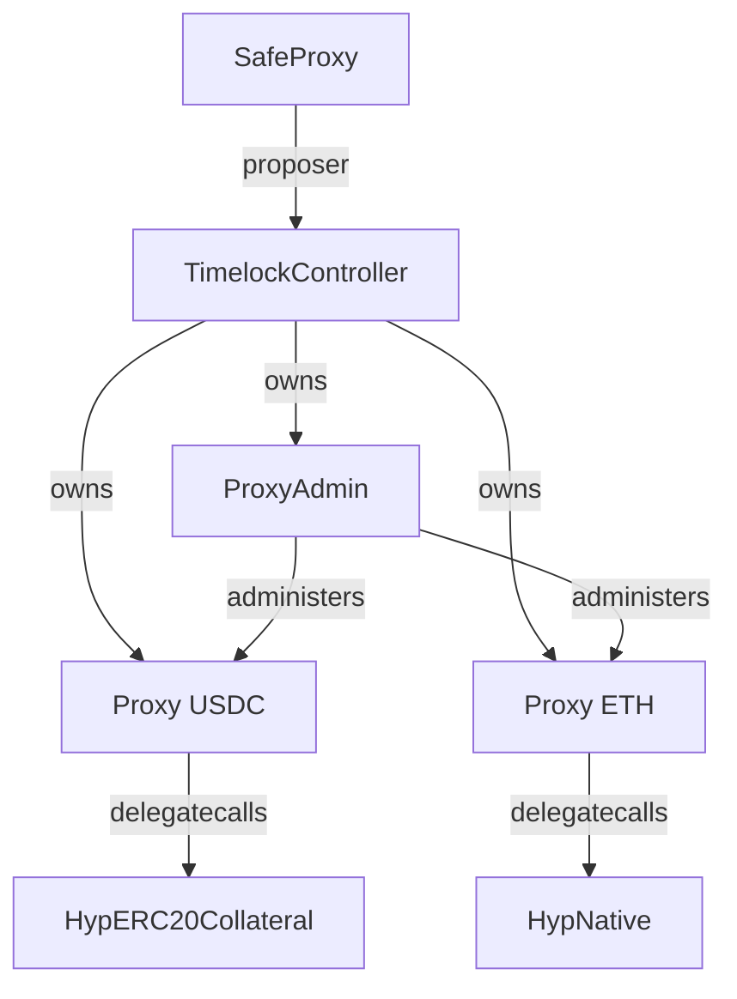

# Constants

This page collects the constants of Dango's mainnet and testnet deployments: API endpoints, chain IDs, contract addresses, and the Hyperlane bridge contracts on EVM chains.

## Endpoints

| Network | HTTP                                     | WebSocket                              |
| ------- | ---------------------------------------- | -------------------------------------- |
| Mainnet | `https://api-mainnet.dango.zone/graphql` | `wss://api-mainnet.dango.zone/graphql` |
| Testnet | `https://api-testnet.dango.zone/graphql` | `wss://api-testnet.dango.zone/graphql` |

The testnet **faucet** is served separately at `https://faucet-testnet.dango.zone/mint` (see [§3.1.1 of the API reference](../perps/8-api.md#311-funding-a-new-account-via-the-faucet-testnet)). There is no faucet on mainnet.

## Chain IDs

| Network          | CometBFT Chain ID | EIP-155 Chain ID | [Hyperlane Domain ID](https://docs.hyperlane.xyz/docs/reference/domains) |
| ---------------- | ----------------- | ---------------- | ------------------------------------------------------------------------ |
| Dango            | `dango-1`         | -                | `88888888`                                                               |
| Dango Testnet    | `dango-testnet-1` | -                | `88888887`                                                               |
| Ethereum         | -                 | `1`              | `1`                                                                      |
| Sepolia          | -                 | `11155111`       | `11155111`                                                               |
| Arbitrum         | -                 | `42161`          | `42161`                                                                  |
| Arbitrum Sepolia | -                 | `421614`         | `421614`                                                                 |

## Dango contract addresses

| Name                       | Mainnet                                      | Testnet                                      |
| -------------------------- | -------------------------------------------- | -------------------------------------------- |
| `ACCOUNT_FACTORY_CONTRACT` | `0x18d28bafcdf9d4574f920ea004dea2d13ec16f6b` | `0x18d28bafcdf9d4574f920ea004dea2d13ec16f6b` |
| `MAILBOX_CONTRACT`         | `0x974e57564ed3ed7d8f99d0c359fd03f3d78259c7` | `0x974e57564ed3ed7d8f99d0c359fd03f3d78259c7` |
| `ORACLE_CONTRACT`          | `0xcedc5f73cbb963a48471b849c3650e6e34cd3b6d` | `0xcedc5f73cbb963a48471b849c3650e6e34cd3b6d` |
| `PERPS_CONTRACT`           | `0x90bc84df68d1aa59a857e04ed529e9a26edbea4f` | `0xf6344c5e2792e8f9202c58a2d88fbbde4cd3142f` |

## Code hashes

| Name                     | Value                                                              |
| ------------------------ | ------------------------------------------------------------------ |
| Single-signature account | `d86e8112f3c4c4442126f8e9f44f16867da487f29052bf91b810457db34209a4` |

The code hash is the same on mainnet and testnet.

## Hyperlane deployments

Dango bridges assets to and from EVM chains via [Hyperlane](https://hyperlane.xyz/) warp routes. The tables below list the relevant contracts on each chain: Ethereum and Arbitrum serve Dango mainnet; Sepolia and Arbitrum Sepolia serve Dango testnet. The first three rows of each table are contracts deployed by other parties (Circle, Hyperlane), included for reference; the rest are deployed by us. Our contracts are not deployed on Arbitrum and Arbitrum Sepolia yet (marked TBD).

### Ethereum

| Contract                            | Description                      | Address                                                                                                                     |
| ----------------------------------- | -------------------------------- | --------------------------------------------------------------------------------------------------------------------------- |
| `FiatTokenProxy`                    | USDC token                       | [`0xA0b86991c6218b36c1d19D4a2e9Eb0cE3606eB48`](https://etherscan.io/address/0xA0b86991c6218b36c1d19D4a2e9Eb0cE3606eB48)[^1] |
| `Mailbox`                           | Hyperlane mailbox                | [`0xc005dc82818d67AF737725bD4bf75435d065D239`](https://etherscan.io/address/0xc005dc82818d67AF737725bD4bf75435d065D239)[^2] |
| `StaticMessageIdMultisigIsmFactory` | Hyperlane multisig ISM factory   | [`0xfA21D9628ADce86531854C2B7ef00F07394B0B69`](https://etherscan.io/address/0xfA21D9628ADce86531854C2B7ef00F07394B0B69)[^3] |
| `TransparentUpgradeableProxy`       | Warp-route proxy (USDC)          | [`0xd05909852aE07118857f9D071781671D12c0f36c`](https://etherscan.io/address/0xd05909852aE07118857f9D071781671D12c0f36c)     |
| `HypERC20Collateral`                | Warp-route implementation (USDC) | [`0xE071653043828C9923c79B04B077358D94Fc84f9`](https://etherscan.io/address/0xE071653043828C9923c79B04B077358D94Fc84f9)     |
| `TransparentUpgradeableProxy`       | Warp-route proxy (ETH)           | [`0x9d259aa1eC7324C7433b89d2935b08C30f3154cB`](https://etherscan.io/address/0x9d259aa1eC7324C7433b89d2935b08C30f3154cB)     |
| `HypNative`                         | Warp-route implementation (ETH)  | [`0x9d0ea335355dA17eE89E50DF43AB823416Cf73d4`](https://etherscan.io/address/0x9d0ea335355dA17eE89E50DF43AB823416Cf73d4)     |
| `ProxyAdmin`                        | Proxy administrator              | [`0x613942eff27c6886bb2a33a172cdaf03a009e601`](https://etherscan.io/address/0x613942eff27c6886bb2a33a172cdaf03a009e601)     |
| `TimelockController`                | Timelock (48 hr)                 | [`0xdEc7A9906d143288cD412C0e627bA3B9a91fC8A1`](https://etherscan.io/address/0xdEc7A9906d143288cD412C0e627bA3B9a91fC8A1)     |
| `SafeProxy`                         | Dango team multisig              | [`0x94115077A1Dbe2944935186625D57e2e10Fb807D`](https://etherscan.io/address/0x94115077A1Dbe2944935186625D57e2e10Fb807D)     |

### Sepolia

| Contract                            | Description                      | Address                                                                                                                             |
| ----------------------------------- | -------------------------------- | ----------------------------------------------------------------------------------------------------------------------------------- |
| `FiatTokenProxy`                    | USDC token                       | [`0x1c7D4B196Cb0C7B01d743Fbc6116a902379C7238`](https://sepolia.etherscan.io/address/0x1c7D4B196Cb0C7B01d743Fbc6116a902379C7238)[^1] |
| `Mailbox`                           | Hyperlane mailbox                | [`0xfFAEF09B3cd11D9b20d1a19bECca54EEC2884766`](https://sepolia.etherscan.io/address/0xfFAEF09B3cd11D9b20d1a19bECca54EEC2884766)[^4] |
| `StaticMessageIdMultisigIsmFactory` | Hyperlane multisig ISM factory   | [`0xFEb9585b2f948c1eD74034205a7439261a9d27DD`](https://sepolia.etherscan.io/address/0xFEb9585b2f948c1eD74034205a7439261a9d27DD)[^5] |
| `TransparentUpgradeableProxy`       | Warp-route proxy (USDC)          | [`0x0d8c3516Df20cfF940E479Ea2d8C7d1Dd0A706ac`](https://sepolia.etherscan.io/address/0x0d8c3516Df20cfF940E479Ea2d8C7d1Dd0A706ac)     |
| `HypERC20Collateral`                | Warp-route implementation (USDC) | [`0x26BC0E68467D88cedB5A3793618C8F6586512706`](https://sepolia.etherscan.io/address/0x26BC0E68467D88cedB5A3793618C8F6586512706)     |
| `TransparentUpgradeableProxy`       | Warp-route proxy (ETH)           | [`0xE3109F83BeF36AecE35870ee1B2e07A5DD12CFA9`](https://sepolia.etherscan.io/address/0xE3109F83BeF36AecE35870ee1B2e07A5DD12CFA9)     |
| `HypNative`                         | Warp-route implementation (ETH)  | [`0xb4513d39e6839bf7C1f01a65e294bAB8B16b5887`](https://sepolia.etherscan.io/address/0xb4513d39e6839bf7C1f01a65e294bAB8B16b5887)     |
| `ProxyAdmin`                        | Proxy administrator              | [`0x59cf4f33ce42afa957b93e68031f07bf6d299d60`](https://sepolia.etherscan.io/address/0x59cf4f33ce42afa957b93e68031f07bf6d299d60)     |
| `TimelockController`                | Timelock (5 min)                 | [`0x256363b42F874D08A92ab857622753053006D4b3`](https://sepolia.etherscan.io/address/0x256363b42F874D08A92ab857622753053006D4b3)     |
| `SafeProxy`                         | Dango team multisig              | [`0x94115077A1Dbe2944935186625D57e2e10Fb807D`](https://sepolia.etherscan.io/address/0x94115077A1Dbe2944935186625D57e2e10Fb807D)     |

### Arbitrum

| Contract                            | Description                      | Address                                                                                                                    |
| ----------------------------------- | -------------------------------- | -------------------------------------------------------------------------------------------------------------------------- |
| `FiatTokenProxy`                    | USDC token                       | [`0xaf88d065e77c8cC2239327C5EDb3A432268e5831`](https://arbiscan.io/address/0xaf88d065e77c8cC2239327C5EDb3A432268e5831)[^1] |
| `Mailbox`                           | Hyperlane mailbox                | [`0x979Ca5202784112f4738403dBec5D0F3B9daabB9`](https://arbiscan.io/address/0x979Ca5202784112f4738403dBec5D0F3B9daabB9)[^6] |
| `StaticMessageIdMultisigIsmFactory` | Hyperlane multisig ISM factory   | [`0x12Df53079d399a47e9E730df095b712B0FDFA791`](https://arbiscan.io/address/0x12Df53079d399a47e9E730df095b712B0FDFA791)[^7] |
| `TransparentUpgradeableProxy`       | Warp-route proxy (USDC)          | TBD                                                                                                                        |
| `HypERC20Collateral`                | Warp-route implementation (USDC) | TBD                                                                                                                        |
| `TransparentUpgradeableProxy`       | Warp-route proxy (ETH)           | TBD                                                                                                                        |
| `HypNative`                         | Warp-route implementation (ETH)  | TBD                                                                                                                        |
| `ProxyAdmin`                        | Proxy administrator              | TBD                                                                                                                        |
| `TimelockController`                | Timelock                         | TBD                                                                                                                        |
| `SafeProxy`                         | Dango team multisig              | TBD                                                                                                                        |

### Arbitrum Sepolia

| Contract                            | Description                      | Address                                                                                                                            |
| ----------------------------------- | -------------------------------- | ---------------------------------------------------------------------------------------------------------------------------------- |
| `FiatTokenProxy`                    | USDC token                       | [`0x75faf114eafb1BDbe2F0316DF893fd58CE46AA4d`](https://sepolia.arbiscan.io/address/0x75faf114eafb1BDbe2F0316DF893fd58CE46AA4d)[^1] |
| `Mailbox`                           | Hyperlane mailbox                | [`0x598facE78a4302f11E3de0bee1894Da0b2Cb71F8`](https://sepolia.arbiscan.io/address/0x598facE78a4302f11E3de0bee1894Da0b2Cb71F8)[^8] |
| `StaticMessageIdMultisigIsmFactory` | Hyperlane multisig ISM factory   | [`0xF7F0DaB0BECE4498dAc7eb616e288809D4499371`](https://sepolia.arbiscan.io/address/0xF7F0DaB0BECE4498dAc7eb616e288809D4499371)[^9] |
| `TransparentUpgradeableProxy`       | Warp-route proxy (USDC)          | TBD                                                                                                                                |
| `HypERC20Collateral`                | Warp-route implementation (USDC) | TBD                                                                                                                                |
| `TransparentUpgradeableProxy`       | Warp-route proxy (ETH)           | TBD                                                                                                                                |
| `HypNative`                         | Warp-route implementation (ETH)  | TBD                                                                                                                                |
| `ProxyAdmin`                        | Proxy administrator              | TBD                                                                                                                                |
| `TimelockController`                | Timelock                         | TBD                                                                                                                                |
| `SafeProxy`                         | Dango team multisig              | -                                                                                                                                  |

### Ownership chain

The ownership structure is identical on every chain (except Arbitrum Sepolia, which has no `SafeProxy`, because the Safe frontend doesn't support that chain):

[^1]: [USDC contract addresses — Circle docs](https://developers.circle.com/stablecoins/usdc-contract-addresses)
[^2]: [`hyperlane-registry`: `chains/ethereum/addresses.yaml` line 8](https://github.com/hyperlane-xyz/hyperlane-registry/blob/main/chains/ethereum/addresses.yaml#L8)
[^3]: [`hyperlane-registry`: `chains/ethereum/addresses.yaml` line 20](https://github.com/hyperlane-xyz/hyperlane-registry/blob/main/chains/ethereum/addresses.yaml#L20)
[^4]: [`hyperlane-registry`: `chains/sepolia/addresses.yaml` line 8](https://github.com/hyperlane-xyz/hyperlane-registry/blob/main/chains/sepolia/addresses.yaml#L8)
[^5]: [`hyperlane-registry`: `chains/sepolia/addresses.yaml` line 20](https://github.com/hyperlane-xyz/hyperlane-registry/blob/main/chains/sepolia/addresses.yaml#L20)
[^6]: [`hyperlane-registry`: `chains/arbitrum/addresses.yaml` line 8](https://github.com/hyperlane-xyz/hyperlane-registry/blob/main/chains/arbitrum/addresses.yaml#L8)
[^7]: [`hyperlane-registry`: `chains/arbitrum/addresses.yaml` line 20](https://github.com/hyperlane-xyz/hyperlane-registry/blob/main/chains/arbitrum/addresses.yaml#L20)
[^8]: [`hyperlane-registry`: `chains/arbitrumsepolia/addresses.yaml` line 8](https://github.com/hyperlane-xyz/hyperlane-registry/blob/main/chains/arbitrumsepolia/addresses.yaml#L8)
[^9]: [`hyperlane-registry`: `chains/arbitrumsepolia/addresses.yaml` line 20](https://github.com/hyperlane-xyz/hyperlane-registry/blob/main/chains/arbitrumsepolia/addresses.yaml#L20)
