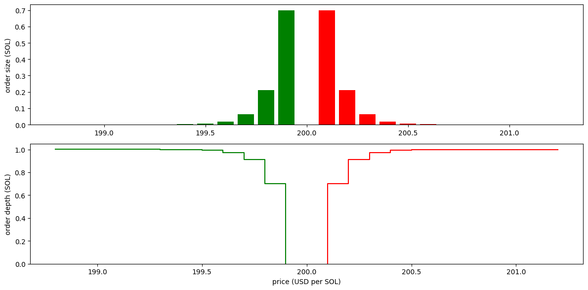

# Dango DEX

A fully onchain central limit order book (CLOB) with two unique characteristics:

- the use of **periodic auctions** to execute limit orders, which deters toxic flow and minimizes MEV extraction; and
- the incorporation of a **passive market making vault** system, which creates new yield opportunity for retail capital and facilitates the bootstrapping of liquidity.

## Features

### Periodic auctions

Periodic auctions or **frequent batch auctions** (FBAs) was [introduced in academic literature](https://academic.oup.com/qje/article/130/4/1547/1916146) in 2015 as a means to combat the negative externalities of **latency arbitrage**.

Latency arbitrage is a trading strategy that profits when the following situation occurs: suppose there are two exchanges; exchange A is highly liquid, does a great amount of volume, and is where price discovery happens; exchange B, on the other hand, is smaller, where prices simply follow exchange A. Suppose an asset trades at $100 in both exchange; then, upon the emergence of a new bullish information, it jumps to $100.5 in exchange A. However, due to latency in the propagation of this information, market makers in exchange B are still quoting $100 ("**stale quotes**"). Here, a trader who has access to a low latency internet connection can buy the asset in exchange B for $100 (before any market makers there is able to update their quotes to $100.5), then immediately sell at exchange A for $100.5, pocketing the difference.

Latency arbitrage is generally considered harmful, because market makers in exchange B lose money in the process: they sold the asset at $0.5 lower than its prevailing market price, simply because of latency and not of being directionally wrong. Over time, this loss can add up and turn their operation from profitable to unprofitable. This discourages them from continuing to market make in exchange B, which leads to thinner liquidity, less volume, and thus even less market making profit: a vicious spiral. As such, latency arbitrage trades are often also dubbed **toxic flow**.

For crypto assets, especially short tail such as BTC and ETH, "exchange A" here is typically the big CEXs such as Binance, while "exchange B" is typically onchain AMMs such as Uniswap. An exception to this is the memecoins, for which price discovery happens primarily onchain and not in CEXs.

The toxic flow situation in onchain AMMs is categorically worse than in TradFi, because whereas TradFi market makers can at least invest in faster internet connectivity in attempt to run faster than arbs, earlier generation AMMs such as Uniswap V2 _never adjust quotes at all_. Newer AMMs such as Uniswap V3 does allow market makers to adjust their quotes, but doing so requires paying gas fee as well as bribes to sequencers, which can cost even more than the loss from arbs. The situation is so bad that Eugene Chen, founder of Ellipsis Labs, [recommends against](https://x.com/0xShitTrader/status/1579510561267929089) retail investors from LP'ing in AMMs at all, suggesting that doing so "is almost always a money-losing enterprise".

Hyperliquid tackles this problem by [introducing a special block building rule](https://hyperliquid.medium.com/latency-and-transaction-ordering-on-hyperliquid-cf28df3648eb): a block must contain all the order cancelations first, only then followed by other types of transactions. As such, as long as a market maker isn't more than one block slower than the fastest arbitrageur, he can always take off the stale quote before it is picked up by the arb. This has quickly become one of Hyperliquid's most beloved features by traders.

At Dango, we choose an alternative solution: periodic auctions. This works as follows: as the sequencer proposes a new block, the chain goes through the transactiosn one by one. If a transaction is an order cancelation, it's executed immediately; otherwise, if it's an order submission, the order is simply inserted into the order book. The order is otherwise not executed at this time. Then, at the end of the block, the chain grabs all the orders in the book, and performs a **uniform price double auction** that finds _a single clearing price for all orders_, and fills the orders at this price. See [this post](https://motokodefi.substack.com/p/uniform-price-call-auctions-a-better) for the algorithm.

This approach has the same effect as Hyperliquid's, in that a market maker can always update his stale quote, as long as he isn't more than one block slower than the fastest arbitrageur. Additionally, as all orders are matched together, their sequence of submission is irrelevant; this minimizes MEV.

We plan to set our block time (that is, simultaneously the auction period) to 200 ms, which is fast enough to feel instanteous for retail users, while providing a large enough leeway that even the slowest market maker is protected against toxic flow.

### Passive market making vaults

We've mentioned that LP'ing in AMMs almost certainly means losing money. Given this unfortunate fact, if, for example, I have some BTC-USDC liquidity and wish to earn a yield on it through market making, what are my options? At the time we're writing this article, the answer is there isn't any option. There isn't a battle tested, completely passive, toxic flow-resistent, market making vault for the spot market. There's a good amount of retail capital that seeks yield but finds nowhere to be deployed.

The incorporation of such vaults also benefits the protocol in different ways. One great example is Hyperliquid's HLP: it accepts deposits of USDC from retail users, which the Hyperliquid team then uses to market make in its perpetual futures market. This allowed Hyperliquid to:

- List new trading pairs and bootstrap liquidity _quickly_. It turns out the Hyperliquid is often the only place to leverage trade the newest, hottest crypto coins.
- Not have to pay any external market maker, and therefore be able to direct as much revenue as possible to the HYPE token (through token buybacks).

These two advantages (along with a great UX--thanks to being a sovereign L1--and a masterfully executed airdrop) contributed greatly Hyperliquid's rise to prominence.

Dango attempts to replicate this success, but for the spot market. Dango DEX enshrines each trading pair a vault that accepts deposits of spot assets (e.g. BTC and USDC) and market makes following a preset policy. At launch, it will be equipped with either between two policies:

- **Xyk**: the vault places orders in the book following the constant product formula: $x \times y = K$. This policy is suitable for long tail assets, of which price discovery happens primarily on Dango (otherwise, it would be susceptible to toxic flow). The only asset we plan to use this policy is the future Dango token.

  

- **Oracle guided, concentrated liquidity**: the vault places orders concentrated around the price reported by a low latency oracle. It offers accurate quote and slow slippage, suitable for bluechip crypto and RWA assets.

  Currently, this policy is rather naïve--it doesn't compute a mid price or adjust spread based on its inventory. We expect the policy to be polished as development continues.

  

See [this notebook](../../notebooks/passive_liquidity.ipynb) for the algorithms and Python prototypes.

## Implementation

### Oracle

For an oracle-guided market making policy, [it's vital that the oracle price is accurate and up-to-date](https://fenbushi.vc/2024/01/20/ending-lps-losing-game-exploring-the-loss-versus-rebalancing-lvr-problem-and-its-solutions/#:~:text=unbounded%20losses%20for%20LPs%20in%20the%20event%20of%20inaccurate%20oracle%2Dfed%20prices%20due%20to%20oracle%20manipulation%20or%20oracle%20liveness%20issues). Imagine if the prevailing market price is $100, but the oracle erraneously reports $99, then the vault will quote around $99, creating an opening where arbs can siphon value out of the vault.

We take the following measures to reduce the likelihood of this:

- **Low latency**: we utilize [Pyth](https://www.pyth.network/price-feeds)'s 400 ms price feed. We have plans to upgrade to its [50 ms or 1 ms feed](https://www.pyth.network/blog/introducing-pyth-lazer-launching-defi-into-real-time) in the future.
- **Priority**: oracle data are feeded directly by validators using the [ABCI++](https://docs.cometbft.com/main/tutorials/forum-application/1.abci-intro) `PrepareProposal` method, and is pinned to the top of the block. In other words, oracle update is always the first thing that ever happens in a block; everything else in the block always happen according to the most recent price data.
- **Circuit breakers**: if an anomaly is detected, the vault automatically halts: stops placing any order, until the oracle is recovered. We currently monitor one anomaly: _outage_ (the most recent oracle price is older than a threshold). In the future, we also plan to monitor _irregular price movements_: price jumping too bigly given its normal level of volatility; e.g. BTC going from $100k to $1k within a minute.

### Market orders

The discussions we've had on periodic auctions only concern limit orders. For market orders, we handle separately. In the end-block routine, _before_ the auction for limit orders, we match BUY market orders against the SELL side of the limit order book, and SELL market orders against the BUY side of the limit order book. See [this notebook](../../notebooks/market_order.ipynb) for the algorithm.

### Instant swaps

A drawback of the period auction model is that trades are **asynchronous**--in the sense that the order isn't executed in the same transaction where it's submitted; execution has to wait until the end of the block. This difference isn't discernable for human users--in regular continuous time exchanges, they also need to wait until a block is finalized for their trade to settle, so there isn't any extra latency introduced in our model.

However, this asynchronous nature goes poorly with a specific use case: **flashloans**, which needs to be repaid in the same transaction. Unfortunately, our liquidation bot does utilize flashloans to carry out liquidations. To address this, we introduce **instant swaps** as an alternative way to trade.

To do an instant swap, call the DEX's `swap_exact_amount_{in,out}` functions. The trade is executed against the vault liquidity only. Each vault type has its own way of handling instant swaps; in the case of xyk vaults, for example, it's simply a normal xyk swap.

Since a periodic auction isn't involved, these swaps can be executed instantly in the same transaction. However, they do have the drawback that liquidity from user orders isn't utilized. For use cases that don't involve flashloans, submitting a regular market or limit order almost certainly results in better execution price; for use cases that do involve flashloans though, instant swap is the only option.

Another benefit of instant swap is it supports **routing**, meaning, trading across multiple pairs in one go (e.g. BTC --> USDC --> ETH).

### Unbalanced liquidity provision

For deposits into the market making vault, we want to make possible unbalanced or single-sided deposits. It would be a bad UX if we force users to bring the assets in exactly the proportion as the vault's inventory.

However, for unbalanced provisions, it's important to deter the following exploit: deposit USDC single-sidedly into the BTC-USDC vault, then immediately withdraw. This effectively does a swap of USDC into BTC without paying any trading fee.

To combat this, we implement a fee for unbalanced deposits, utilizing the oracle feed. Let's illustrate with an example: suppose the pool contains $100 BTC + $100 USDC; a user intends to deposit $100 BTC + $90 USDC. After the injection of the liquidity, the pool would have $200 BTC + $190 USDC. To restore the pool to the proportion as before, we would need to swap $5 BTC to USDC. We then charge a normal swap fee on this $5, by the means of minting correspondingly less LP shares to the user.

Of course, this approach doesn't perfectly simulates a real swap, as it doesn't consider slippage. However, it's good enough for deterring the specific attack mentioned.

### Rounding errors

In smart contracts, we don't deal with **human units** of the assets (e.g. USDC); instead, we deal with their **basic units** (micro-USDC a.k.a. uusdc). Since basic units are indivisible, a natural choice is to represent them as integers.

However, we quickly ran into a tricky situation with integers: **rounding**. If you trade 5 uusdc into ETH at the rate of 2 uusdc per wei, you get 2.5 wei. However, since wei is indivisible, this is rounded down to 2 wei.

A 0.5 wei difference may seem inconsequential, but consider that a big order may be filled against many other orders. In each instance of filling, there may be up to 1 unit of rounding error. For very big orders, we notice the rounding error can add up to the point it's not negligible. Therefore, we made the decision to represent asset amounts as **fixed point decimal numbers** throughout this contract. Then, we only round down the number once, at the end of the auction, when transferring assets out from the contract to the user. This way, there is at most 1 unit of rounding error, per block, per user, across all orders this user have in this block.

The question is, then, which number type to use. There are two variables we have to decide: word size (128 bits vs 256) and precision (how many decimal places). [CosmWasm](https://github.com/CosmWasm/cosmwasm/blob/main/packages/std/src/math/decimal.rs#L19-L21) provides 128-bit, 18-decimal as the default decimal number type. Since our VM is a spiritual successor to CosmWasm, we considered using this initially. We quickly realized it isn't sufficient: the biggest number it can represent is $(2^{128} - 1) \times 10^{-18} = 3.40 \times 10^{20}$. Taking ETH as example, which has 18 decimals, this translates to $3.40 \times 10^2$ human units. It's certainly possible that someone submits an order of more than 340 ETH!

We decided that 6 decimals is enough for the purpose of mitigating rounding errors. With 6 decimals, 128 bits is sufficient to represent any sensible asset amount. Therefore, you will see amounts and volumes throughout the contract denoted as `Udec128_6`.

### Representation of prices

We had to make a similar decision regarding which number type to use for prices. Remember, we aren't dealing with human prices, but prices denoted in basic units. For example, the ETH price at the time we're writing this article ($3,000) becomes:

$$
3,000 \ \mathrm{USDC \ per \ ETH} \times \frac{10^6 \ \mathrm{uusdc \ per \ USDC}}{10^{18} \ \mathrm{wei \ per \ ETH}} = 3 \times 10^{-9} \ \mathrm{uusdc \ per \ wei}
$$

This number doesn't pose a problem, but consider a very low price coin such as SHIB, which has 18 decimals and is trading at 0.000015 USDC per SHIB. This translates to 0.000000000000000015 or $1.5 \times 10^{-17}$ uusdc per unit of SHIB, which barely fits in our `Udec128`, which has 18 decimal places. If SHIB goes a 94% drawdown (not a totally impossible scenario) the price would be $0.99 \times 10^{-18}$ which can't be represented by `Udec128` (it would round down to zero).

We decided to use 24 decimal places. Of course, with more decimal places, we can represent smaller numbers, but the maximum number we can represent is also lower. With 128 bits, this would be $(2^{128} - 1) \times 10^{-24} = 3.40 \times 10^{14}$, which is good enough for any sensible price. Therefore, you will see prices throughout the contract denoted as `Udec128_24`.

Another solution is to scale the asset amount during bridging. For example, we mint 1 unit token on Dango for every $10^9$ units of SHIB bridged in. We however decided this would be an overkill for a simple problem.

### Direction of rounding

Continue on the topic of rounding, another question is how do we round a number: flooring or ceiling?

Throughout out the contract, we employ the following principle: _always round to the advantage of the protocol, and to the disadvantage to the user_. Empirically, this is a necessary (although [not always sufficient](https://osec.io/blog/2024-01-18-rounding-bugs)) condition for deterring exploits.

Specifically, we always _round up_ inflows into the contract (e.g. user deposits), and _round down_ outflows from the contract (e.g. transfering the proceeds of a trade to user).

It's also notable that our DEX contracts automatically reject any "donations" by sending tokens directly into it, as it doesn't implement a `receive` function. This already makes a few other types of exploits impossible.

### Iterator abstraction

Empirically, the bottleneck for blockchain performance is often disk read/write. We typically want as many things as possible to happen in the CPU cache or the RAM, without touching the hard drive.

A notable optimization we do in Dango DEX that follows this principle, is that the market making vault doesn't _physically_ insert orders to the order book (which is in the disk); instead, during the end-of-block auction, it computes on-the-fly the orders it would place, given its policy and inventory state. Since these orders don't physically exist in the order book, we call them "virtual orders".

Essentially, we have two order books, a physical one and a virtual one. We use a [`MergedOrders`](./src/core/merged_orders.rs) structure to combine them into one, leveraging Rust's zero cost iterator abstraction. Interestingly, we adapted this from [a structure in cw-multi-test](https://github.com/CosmWasm/cw-multi-test/blob/main/src/transactions.rs#L22-L29) that is intended for a completely different purpose: to mock a cached blockchain storage.

## Related works

The only other application of periodic auctions in DeFi, in our knowledge, is [Injective](https://blog.injective.com/injective-exchange-upgrade-a-novel-order-matching-mechanism/).

Whereas many CLOB DEXs employ passive market making vaults, they are mostly for the perpetual futures market, and operates with only the market's settlement asset such as USDC (meaning, you don't earn real BTC from market making in the BTC market). The only application of a passive market making vault in the spot market, to our knowledge, is [a currently experimental project by Neutron](https://x.com/neutron_org/status/1917995050081964074).

## This crate

Core exchange logics, such as order matching and filling, are implemented as (mostly) **pure functions**, found in the [`core`](./src/core.rs) module.

Non-pure part of the the contract logics--writing data to storage, transferring tokens, and emitting events--are found in the [`execute`](./src/execute.rs) and [`cron`](./src/core.rs) modules. Notably, the `cron_execute` function, which is automatically invoked at the end of each block, contains the logics for the periodic auctions.

Tests are found in the [dango-testing](../testing) crate, in the following files:

- [`tests/dex.rs`](../testing/tests/dex.rs)
- [`tests/dex_proptests.rs`](../testing/tests/dex_proptests.rs)

## Abbreviations

| Short  | Long                              |
| ------ | --------------------------------- |
| AMM    | automated market maker            |
| CEX    | centralized exchange              |
| CLOB   | central limit order book          |
| DeFi   | decentralized finance             |
| DEX    | decentralized exchange            |
| EVM    | Ethereum virtual machine          |
| FBA    | frequent batch auction            |
| LP     | liquidity pool/provision/provider |
| MEV    | miner extractable value           |
| RWA    | real world asset                  |
| TradFi | traditional finance               |
| UX     | user experience                   |
| VM     | virtual machine                   |
