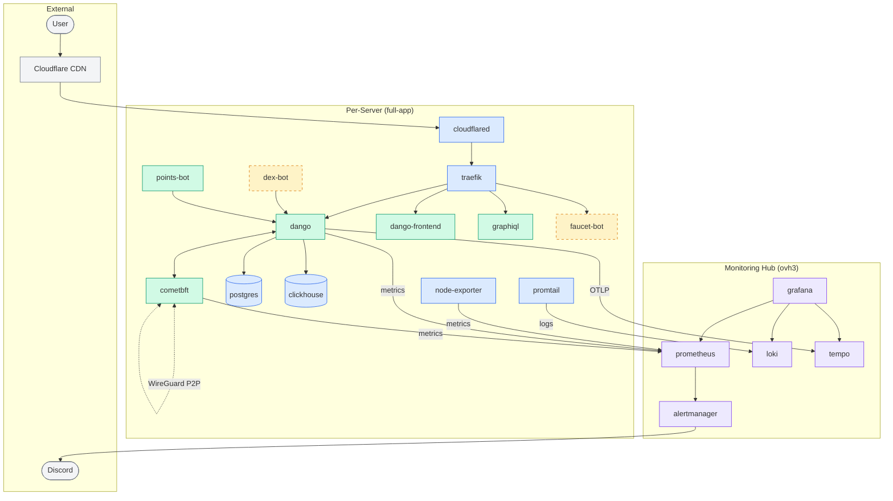

# deploy

## Architecture Overview

This directory contains Ansible playbooks and roles for deploying the Dango
blockchain platform across OVH, Hetzner, and Interserver. Servers communicate
over private networks (WireGuard `10.99.0.x` mesh and Tailscale) and are
exposed to the public internet through Cloudflare tunnels.

### Server Inventory

| Hostname | Tailscale IP   | WireGuard IP | Network        |
| -------- | -------------- | ------------ | -------------- |
| ovh1     | 100.96.253.40  | 10.99.0.1    | devnet         |
| ovh2     | 100.107.248.71 | 10.99.0.2    | devnet         |
| ovh3     | 100.122.37.57  | 10.99.0.3    | monitoring hub |
| inter1   | 100.89.7.33    | 10.99.0.12   | mainnet        |
| inter2   | 100.66.234.16  | 10.99.0.13   | mainnet        |
| hetzner1 | 100.126.8.2    | 10.99.0.8    | mainnet        |
| hetzner2 | 100.90.163.19  | 10.99.0.9    | testnet        |
| hetzner3 | 100.76.197.30  | 10.99.0.10   | mainnet        |
| hetzner4 | 100.109.200.70 | 10.99.0.11   | testnet        |

> ovh4-7 are GitHub Actions runners (not application servers).

### Services

#### Application services (per full-app server)

| Service        | Description                                                     | Notes                 |
| -------------- | --------------------------------------------------------------- | --------------------- |
| dango          | Blockchain node / API server, connects to postgres + clickhouse |                       |
| cometbft       | BFT consensus engine, P2P between nodes via WireGuard           |                       |
| dango-frontend | Web UI                                                          |                       |
| graphiql       | GraphQL IDE                                                     |                       |
| faucet-bot     | Token faucet                                                    | _testnet/devnet only_ |
| dex-bot        | DEX market maker                                                | _testnet/devnet only_ |
| points-bot     | Points/achievements tracking                                    | runs on ovh2          |

#### Infrastructure services (per server)

| Service       | Description                                  |
| ------------- | -------------------------------------------- |
| traefik       | Reverse proxy, TLS termination, port routing |
| cloudflared   | Cloudflare Tunnel for secure ingress         |
| postgres      | Relational database                          |
| clickhouse    | Analytics/indexer database                   |
| promtail      | Ships Docker + system logs to Loki           |
| node-exporter | Exports host metrics for Prometheus          |
| dozzle        | Real-time Docker log viewer                  |

#### Centralized monitoring (ovh3)

| Service    | Description                                                                |
| ---------- | -------------------------------------------------------------------------- |
| grafana    | Dashboards (queries Prometheus, Loki, Tempo)                               |
| prometheus | Metrics collection + alerting (with VictoriaMetrics for long-term storage) |
| loki       | Log aggregation                                                            |
| tempo      | Distributed tracing                                                        |

#### Other services

| Service     | Description                               | Location                   |
| ----------- | ----------------------------------------- | -------------------------- |
| hyperlane   | Cross-chain message validators + relayers | inter1, inter2, hetzner1-4 |
| minio       | S3-compatible object storage              | ovh3                       |
| uptimekuma  | Service health monitoring                 | ovh3                       |
| vaultwarden | Password manager                          | ovh3                       |
| metabase    | BI/analytics dashboards                   | ovh3                       |
| homer       | Service dashboard homepage                | ovh1                       |
| cosign      | Container image signature verification    |                            |

### Architecture Diagram



### Data Flows

- **Metrics**: app containers expose metrics on WireGuard IPs -> Prometheus scrapes (ovh3) -> Grafana dashboards
- **Logs**: Docker containers -> Promtail (per server) -> Loki (ovh3) -> Grafana
- **Traces**: dango emits OTLP -> Tempo (ovh3) -> Grafana
- **Alerts**: Prometheus -> Alertmanager -> Discord webhooks

## How to use

### Add a new user

- Add the username in `group_vars/all/main.yml` in the `ssh_users` section

- Add the public key in `roles/users/files/authorized_keys/<username>.pub`

- Run `ansible-playbook users.yml`

### Install a new server

See [`NEW_SERVER_SETUP.md`](NEW_SERVER_SETUP.md).

### Setup Ansible Vault

#### First time setup (recommended: pass)

If you have [pass](https://www.passwordstore.org/) installed, store the vault password:

```bash
pass insert dango/deploy-vault
# Enter the password when prompted (ASK_TEAM_FOR_PASSWORD)
```

#### First time setup (macOS Keychain fallback)

If you don't have `pass`, you can use macOS Keychain. Add vault password to Keychain:

```bash
security add-generic-password \
  -a ansible \
  -s ansible-vault/default \
  -w 'ASK_TEAM_FOR_PASSWORD'
```

This shows you have the right password:

```bash
❯ ./vault-password.sh | sha256
2f919beb6554c5149ebfdbf03076bed7796fb6853e1d9993bfa259622c7a84e0
```

Make also sure you have ssh-agent and added your key with ssh-add before
running ansible-playbook, else you'll get `Permission denied (publickey)`.

You must rerun `ssh-add` after you rebooted.

Debian-only secrets live in `vaults/debian/root_vault.yml`. You should not
need the debian password for normal deploy workflows; only debian/root
playbooks will try to decrypt that vault, and no extra CLI flags are needed.

#### Root access

No one should need debian/sudo access to the servers, this is a critical
access. But here is the process.

If you have [pass](https://www.passwordstore.org/) installed, store the debian password:

```bash
pass insert dango/debian-vault
# Enter the password when prompted (ASK_TEAM_FOR_PASSWORD)
```

If you don't have `pass`, you can use macOS Keychain. Add debian password to Keychain:

```bash
security add-generic-password \
  -a ansible \
  -s ansible-debian/default \
  -w 'ASK_TEAM_FOR_PASSWORD'
```

This shows you have the right password:

```bash
❯ ./debian-password.sh | sha256
b82a3865821fb1c7072cf58ca641811fd814c892109963f54fce675e7e9cfca5
```

Make also sure you have ssh-agent and added your key with ssh-add before
running ansible-playbook, else you'll get `Permission denied (publickey)`.

You must rerun `ssh-add` after you rebooted.

### Using the deploy key (vaulted)

The private key is encrypted in `group_vars/all/deploy_key.vault`, load it
directly into ssh-agent without writing to disk:

`just add-deploy-key`

Notes:

- Ensure `ssh-agent` is running in your shell (`eval $(ssh-agent -s)` if needed).

### Manual Cosign Verification

Run this after deployments if you need to validate an image digest manually:

```bash
cosign verify \
  --certificate-oidc-issuer https://token.actions.githubusercontent.com \
  --certificate-identity-regexp "https://github.com/left-curve/left-curve/.github/workflows/rust.yml@refs/heads/main" \
  ghcr.io/left-curve/left-curve/dango@sha256:<digest>
```

### Cloudflare tunnels and load balancers

Those are deployed differently for testnet/devnet and PR review apps.

#### PR review apps

When `cloudflare_tunnel_enabled` is set to true, the review app docker compose
includes a cloudflare tunnel container. Then we create CNAME for each service,
to that specific "PR-container" tunnel.

The cloudflared container has a config, routing to containers based on host.

[user] -> (( cloudflare )) -> [cloudflared PR container] -> [destination PR container]

#### devnet/testnet

Each host has a specific cloudflare tunnel name with the hostname. A
`cloudflare` docker network is created. The host running traefik includes the
cloudflare network.

We add a new `traefik` config file, so :80 and :443 and connected to the PR
containers. It routes those port to proper container services based on
hostname.

The cloudflared container has a config, routing to containers based on host.

[user] -> (( cloudflare )) -> [cloudflared system container] -> [system traefik] -> [destination container]
