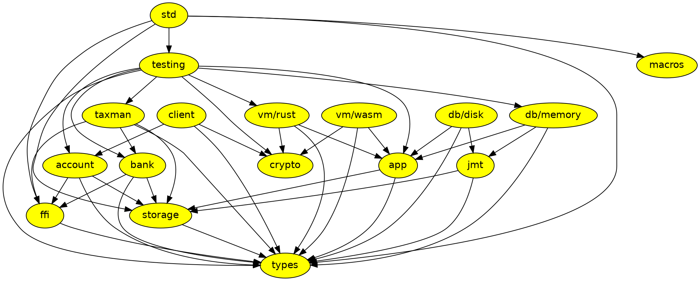

# Generate dependency graph

Dependency relations of the crates in this repository are described by the following [Graphviz](https://graphviz.org/) code:



Install [Graphviz CLI](https://formulae.brew.sh/formula/graphviz) on macOS:

```bash
brew install graphviz
```

Generate SVG from a file:

```bash
dot -Tsvg input.dot
```

Generate SVG from stdin:

```bash
echo 'digraph { a -> b }' | dot -Tsvg > output.svg
```

Alternatively, use the [online visual editor](http://magjac.com/graphviz-visual-editor/).
