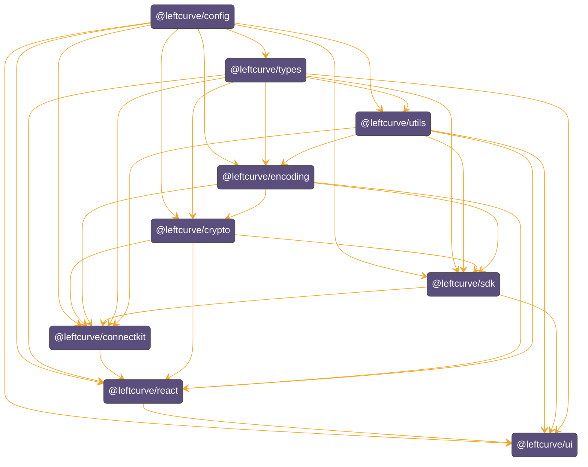

## Interface

You can find more info in our [documentation](https://ui-doc.pages.dev/).

## Packages

#### `/apps`

| App         | Description |
| ----------- | ----------- |
| [PortalApp] | -           |

#### `/packages`

| Package                                  | Description                                                                                                                                                 |
| ---------------------------------------- | ----------------------------------------------------------------------------------------------------------------------------------------------------------- |
| [`config`](./packages/config)            | Common configurations for tsconfig, tsup, biome, typedoc and tailwind                                                                                       |
| [`connect-kit`](./packages/connect-kit/) | It allows connection to multiple blockchains and wallets, manages accounts, and enables interaction with smart contracts.                                   |
| [`crypto`](./packages/crypto)            | It includes various cryptographic functions and utilities for encryption, decryption, hashing, and more.                                                    |
| [`ui`](./packages/ui)                    | React components, hooks, providers and others that help to build [PortalApp]. It includes a [Storybook] server.                                             |
| [`encoding`](./packages/encoding)        | Encoding helpers that are used across packages and assist in encoding and decoding data in various formats                                                  |
| [`react`](./packages/react)              | It wrap connect-kit actions into react-hooks and wrap the state in a react provider with hydration for ssr                                                  |
| [`sdk`](./packages/sdk)                  | The SDK package provides a set of tools and utilities to interact with [Grug] execution environment                                                         |
| [`types`](./packages/types)              | It contains various type definition used across the codebase. These types help ensure type safety and improve code readbility.                              |
| [`utils`](./packages/utils)              | Its a collection of utility functions that are used across the project. These utilities are designed to simplify common tasks and improve code reusability. |

## Module Graph

## Supported JS environments
Packages in the workspace are compiled to JavaScript ES2021, targeting the latest ECMAScript standard, and support both ESM and CJS module formats.

1. Node.js 18+
2. Modern browsers (Chromium/Firefox/Safari)
3. Browser extensions (Chromium/Firefox)

## Development

See [Hacking.md]

## Acknowledgement

This project draws inspiration from and follows some of the architectural design principles of [Viem], while utilizing foundational code from [Wagmi]. Several concepts and ideas have been directly adapted from their codebase, significantly influencing this project.

Additionally, we would like to acknowledge [CosmJS] for providing essential code and tools that contributed to key aspects of this project.

We are grateful to both the [Wevm] and [Confio] team for their open-source contributions and the valuable support they offer to the community.

## License

TBD

[Grug]: https://github.com/left-curve/grug
[Wevm]: https://wevm.dev/
[Wagmi]: https://github.com/wevm/wagmi
[Storybook]: https://storybook.js.org/
[PortalApp]: ./apps/portal
[Hacking.md]: ./HACKING.md
[Viem]: https://github.com/wevm/viem
[CosmJS]: https://github.com/cosmos/cosmjs
[Confio]: https://confio.gmbh/
